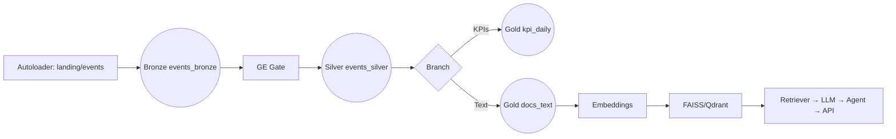
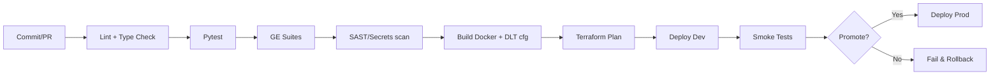
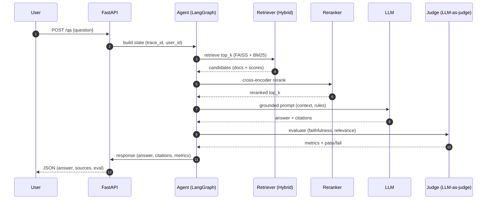
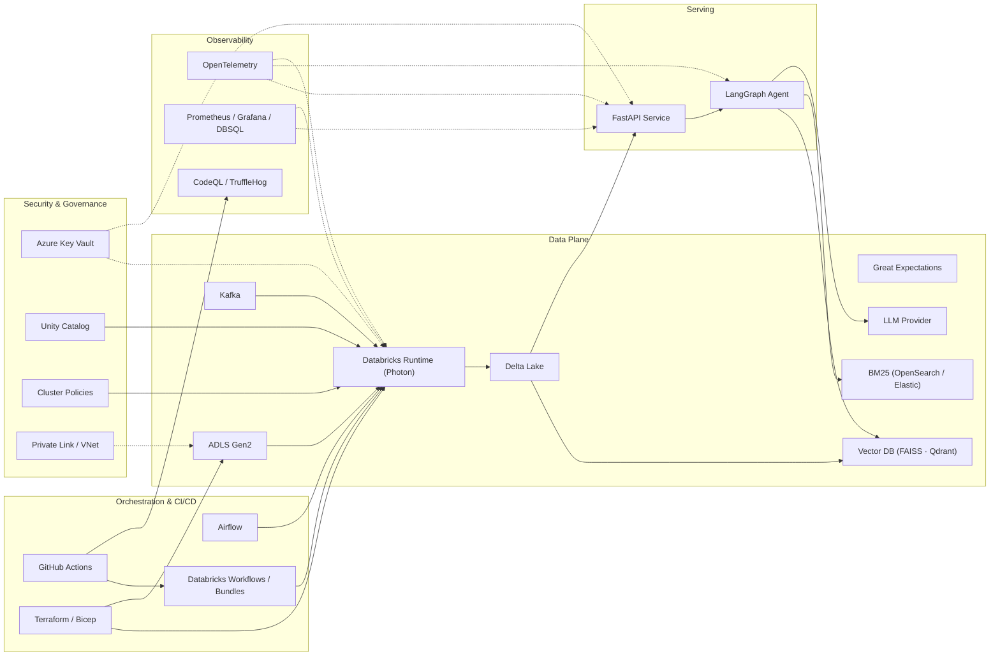

# NILOOMID — AI\_Engineer (Refined, Grade‑A, Step‑by‑Step)

## Project Lifecycle (Best Practice Order, Numberless)

> This is the canonical, numberless **project order** from initiation to steady‑state operations. Each stage lists **Inputs → Actions (commands/code) → Outputs → Validation Gate** and references concrete snippets already in this blueprint (UC SQL, Terraform, DLT, GE, Airflow, Bundles, RAG, API). Nothing was removed—content has been regrouped for lifecycle fit.

### Initiation — Charter, Scope, SLOs

**Inputs:** Business outcomes, stakeholders, data domains, risk posture.
**Actions:** Define scope, success metrics, SLOs (p95 ≤ 2.5s; GE ≥ 99%; hit‑rate ≥ 0.85; cost caps), privacy boundaries; record ADRs and policies in `/docs`.
**Outputs:** Approved charter, ADRs, SLO/SLI docs, RACI.
**Validation:** Stakeholder sign‑off in PR; tracked OKRs.

### Governance & Risk — RBAC, Data Contracts, Compliance

**Inputs:** Entra groups, security standards, retention rules.
**Actions:** Map roles to UC groups and workspace permissions; author **data contracts** (`/contracts/*.yml`); pick masking/RLS strategy; outline incident workflows.
**Outputs:** RBAC matrix, contracts, DLP policy, incident playbooks.
**Validation:** Security review; CI contract‑diff check enabled.

### Architecture & Design — HLA, LLD, Data Flows, Tooling

**Inputs:** Platform choices (Azure, Databricks, UC), ingestion patterns, RAG scope.
**Actions:** Finalize **HLA**, **LLD**, DLT dataflow, **RAG sequence**; confirm tool stack (Terraform, Bundles, Airflow, GE, FAISS/Qdrant, BM25, LangGraph, FastAPI, OTel).
**Outputs:** Diagrams in `/docs/diagrams` and **System (Tools) Integrations HLA & Table**.
**Validation:** Design review; non‑crossing dataflow approved.

### Environment Provisioning — Infra as Code

**Inputs:** Subscription/tenant IDs, naming/tags.
**Actions:** Apply **Terraform** to create RG, VNet/Subnet, **ADLS Gen2**, **Key Vault**, **Databricks Workspace**, **Access Connector** (see Infra TF).
**Outputs:** Resource IDs, Access Connector principal.
**Validation:** `terraform apply` success; portal state correct.

### Networking — Private Link & DNS (Recommended)

**Inputs:** VNet/subnet.
**Actions:** Create **Private Endpoints** and **Private DNS zones** for Storage/KV; restrict egress via NSGs/Firewall.
**Outputs:** Private data plane.
**Validation:** `nslookup *.privatelink.*` resolves; public paths blocked.

### Databricks & Unity Catalog — Bootstrap & RBAC

**Inputs:** Access Connector, Storage URL, Entra groups.
**Actions:** Run **UC SQL** to create **STORAGE CREDENTIAL**, **EXTERNAL LOCATION**, **CATALOGS**, **SCHEMAS** (`raw/clean/gold/meta/ops`), **VOLUMES**; apply **GRANTS**.
**Outputs:** Managed governance surface; lineage enabled.
**Validation:** `SHOW CATALOGS/SCHEMAS/GRANTS` and lineage graph captured.

### Security Foundations — Secrets & Cluster Policies

**Inputs:** KV URI & resource ID, cluster policy JSON.
**Actions:** Create **Key Vault–backed secret scope**; enforce **Single‑User + Photon** cluster policy; tag clusters with CostCenter/Owner.
**Outputs:** `kv-niloomid` scope; policy ID.
**Validation:** `dbutils.secrets.get` works; policy prevents deviations.

### Repository & CI Scaffolding — Layout & Gates

**Inputs:** Repo URL, python toolchain.
**Actions:** Adopt the **Repository Layout (Final, Validated)**; create **GitHub Actions** with lint, pytest, GE, **CodeQL**, **TruffleHog**, **Bundles** deploy.
**Outputs:** Clean repo structure; `.github/workflows/ci.yml`.
**Validation:** CI green on fresh clone; PR checks required.

### Data Quality — Contracts & Great Expectations

**Inputs:** `/contracts/*.yml`, raw schema samples.
**Actions:** Implement **GE** suites and checkpoints; wire CI contract‑diff; define quarantine & backfill runbooks.
**Outputs:** `/ge` configured; quarantine plan; dashboards to monitor pass‑rate.
**Validation:** Local & cluster GE pass ≥ 99%; CI blocks drift.

### Bronze — Ingestion (Streaming & Batch)

**Inputs:** Landing path, schema registry, optional Kafka.
**Actions:** Configure **Autoloader** (JSON/CSV), enable checkpointing; backfill historical; watermark for stream‑batch joins (2h).
**Outputs:** `raw.events_bronze` Delta.
**Validation:** Lag < 5m; schemas versioned; partitions healthy.

### Silver — Cleanse, Conform & DQ Gate

**Inputs:** Bronze, GE suites.
**Actions:** Dedup, type conformance, derive `event_dt`; **GE** gate; write failures to `ops.quarantine_events`.
**Outputs:** `clean.events_silver`, quarantine artifacts.
**Validation:** GE ≥ 99%; constraints enforced; quarantine empty in steady state.

### Gold — KPIs & Curated Text

**Inputs:** Silver.
**Actions:** Build **`gold.kpi_daily`** and **`gold.docs_text`** (RAG corpus).
**Outputs:** KPI aggregates; curated text table.
**Validation:** Counts match expectations; dashboards query successfully.

### Retrieval Layer — Vector & Lexical

**Inputs:** `gold.docs_text`.
**Actions:** Clean & chunk; compute **embeddings**; create **FAISS** index (in‑proc) or **Qdrant** collection; enable **BM25** (OpenSearch/Elastic).
**Outputs:** ANN index + lexical index.
**Validation:** kNN smoke returns relevant items; cosine ≥ 0.6.

### RAG Chain — Hybrid + Reranker + Grounded Prompting

**Inputs:** Vector & BM25 indices, prompts.
**Actions:** Hybrid retrieve → cross‑encoder **rerank** → grounded prompt to LLM; return citations `[doc_id:chunk_id]`.
**Outputs:** Deterministic, auditable QA chain.
**Validation:** `hit_rate ≥ 0.85` and `faithfulness ≥ 0.75` on eval set.

### Agent & API — Serving & Guardrails

**Inputs:** RAG chain, KV secrets.
**Actions:** Build **LangGraph** agent; expose **FastAPI** `/qa`; add **OTel** traces, latency guardrails; containerize (Docker).
**Outputs:** `niloomid/ai-api` image; service endpoint.
**Validation:** Canary p95 ≤ 2.5s; traces visible; citations present.

### ELT Orchestration — DLT, Workflows, Airflow

**Inputs:** `dlt/pipeline.json`, notebooks, Bundles config, Airflow provider.
**Actions:** Run **DLT** continuous with expectations; define **Databricks Workflows** via **Bundles**; schedule **Airflow** DAG for batch sequences.
**Outputs:** Continuous ELT + scheduled jobs.
**Validation:** Expectations firing; all runs green; SLAs met.

### CI/CD — Promotion Gates & Security Scans

**Inputs:** Actions workflows.
**Actions:** Lint, tests, GE, **CodeQL**, **TruffleHog**; Bundles deploy dev→prod with approvals and rollback.
**Outputs:** Immutable deploy pipeline.
**Validation:** All gates pass; rollback tested.

### Observability & SRE — Logs, Metrics, Traces, Alerts

**Inputs:** OTel exporter, metrics spec.
**Actions:** Emit structured logs/metrics/traces; build **Grafana/DBSQL** dashboards (throughput, lag, GE pass, retrieval stats, token cost); configure alerts.
**Outputs:** Dashboards + alerting.
**Validation:** Synthetic checks green; on‑call rota documented.

### Evaluation & Judgement — Offline & Online

**Inputs:** Labeled eval set; golden questions.
**Actions:** Run offline harness (precision\@k, hit‑rate, faithfulness); enable online judge & circuit breakers; log metrics to `ops.rag_eval_metrics`.
**Outputs:** Evaluation reports & daily aggregates.
**Validation:** Thresholds maintained; regressions auto‑blocked.

### Security Hardening — Privacy & Access Controls

**Inputs:** Policies, group maps.
**Actions:** Implement masking/RLS views; rotate secrets; remove PATs; IP allowlists; audit lineage; pen‑test fixes.
**Outputs:** Compliant, locked‑down footprint.
**Validation:** Access review & audit satisfied.

### Go‑Live & Handover — Production

**Inputs:** Validation checklist & evidence.
**Actions:** 10% canary; monitor 24h; promote to 100%; publish runbooks & ownership.
**Outputs:** Live system; handover to operations.
**Validation:** SLO & cost steady; incident drill completed.

## Repository Layout (Final, Validated)

```
repo-root/
├── .github/
│   └── workflows/
│       └── ci.yml                  # lint, pytest, GE, CodeQL, TruffleHog, Bundles deploy
├── infra/
│   ├── terraform/                  # RG, VNet, ADLS, KV, Databricks, Access Connector, Private Endpoints
│   └── bicep/                      # optional Azure-native templates
├── workflows/
│   └── databricks.yml              # Databricks Asset Bundles (jobs/workflows/envs)
├── notebooks/
│   ├── 00_setup_uc.sql            # catalogs, schemas, grants (UC)
│   ├── 10_autoloader_bronze.py    # streaming & batch landing (Autoloader)
│   ├── 20_silver_cleaning.py      # cleanse, conform, GE gate
│   ├── 30_gold_kpis.sql           # KPI aggregations
│   └── embed_index.py             # build embeddings + FAISS/Qdrant index
├── dlt/
│   └── pipeline.json              # DLT pipeline config (continuous, expectations)
├── dags/
│   └── rag_pipeline.py            # Airflow DAG (silver → gold → embed)
├── src/
│   ├── ingestion.py               # landing helpers (S3/ADLS/HTTP)
│   ├── validation.py              # GE wrappers & contract checks
│   ├── preprocessing.py           # text clean & chunk
│   ├── embed.py                   # embeddings + FAISS/Qdrant helpers
│   ├── rag.py                     # retriever + reranker + QA chain
│   ├── agent.py                   # LangGraph agent graph
│   ├── api.py                     # FastAPI service (/qa)
│   └── utils.py                   # logging, config, retries
├── ge/
│   ├── great_expectations.yml
│   ├── expectations/              # suites
│   └── checkpoints/
├── contracts/
│   └── events.yml                 # schema, SLAs, retention, quality gates
├── docker/
│   ├── api/Dockerfile
│   └── qdrant/docker-compose.yml
├── tests/
│   ├── test_chunks.py
│   ├── test_rag_eval.py
│   ├── test_ingestion.py
│   └── test_api_contracts.py
├── docs/
│   ├── adr/                       # architecture decision records
│   ├── policies/                  # SLOs, RBAC, privacy
│   └── diagrams/                  # HLA.mmd, RAG_sequence.mmd, DLT_flow.mmd
├── data/                          # optional samples for local tests
│   ├── raw/
│   └── samples/
├── requirements.txt
├── .env.example
└── README.md
```

**Validation**

* CI must pass on fresh clone (`pytest`, GE, scans).
* Notebooks runnable under UC with the configured scopes/policies.
* Bundles deploy creates the intended Workflows; DAG succeeds end‑to‑end.

## Low‑Level Design (LLD): Data & AI Pipelines

### Ingestion

* **Batch**: S3/ADLS/HTTP → Bronze via `src/ingestion.py` with retries, idempotent writes
* **Streaming**: Kafka → Bronze Autoloader with 2h watermark for joins

**Bronze Notebook (`10_autoloader_bronze.py`)**

```python
from pyspark.sql.functions import col, input_file_name, current_timestamp
spark.conf.set("cloudFiles.inferColumnTypes", "true")
(spark.readStream
  .format("cloudFiles")
  .option("cloudFiles.format", "json")
  .option("cloudFiles.schemaLocation", "/mnt/lake/_schemas/events")
  .option("cloudFiles.maxFilesPerTrigger", 1000)
  .load("/mnt/lake/landing/events/")
  .withColumn("src_file", input_file_name())
  .withColumn("ingest_ts", current_timestamp())
  .writeStream
  .option("checkpointLocation", "/mnt/lake/_chk/bronze/events")
  .toTable("niloomid_ai.raw.events_bronze"))
```

### Silver (Cleanse/Conform)

* Dedup, null/PII handling, type conformance
* **DQ Gate**: Great Expectations suite must pass → otherwise quarantine & alert

**Silver Notebook (`20_silver_cleaning.py`)**

```python
from pyspark.sql import functions as F
src = spark.table("niloomid_ai.raw.events_bronze")
clean = (src.dropDuplicates(["event_id"])
            .filter("event_type is not null")
            .withColumn("event_dt", F.to_date("event_ts")))
clean.write.mode("overwrite").saveAsTable("niloomid_ai.clean.events_silver")
```

**Great Expectations (example suite)** — `ge/suites/events_silver.json`

```json
{
  "expectations": [
    {"expectation_type": "expect_column_values_to_not_be_null", "kwargs": {"column": "event_type"}},
    {"expectation_type": "expect_column_values_to_match_regex", "kwargs": {"column": "event_id", "regex": "^[A-Z0-9_-]{12,}$"}},
    {"expectation_type": "expect_table_row_count_to_be_between", "kwargs": {"min_value": 1}}
  ]
}
```

### Gold (KPIs/Curated Text)

* Aggregate KPIs for dashboards; build **curated text** table for RAG

**Gold SQL (`30_gold_kpis.sql`)**

```sql
CREATE TABLE IF NOT EXISTS niloomid_ai.gold.kpi_daily AS
SELECT event_dt, event_type, COUNT(*) AS cnt
FROM niloomid_ai.clean.events_silver
GROUP BY event_dt, event_type;

CREATE TABLE IF NOT EXISTS niloomid_ai.gold.docs_text AS
SELECT doc_id,
       CONCAT_WS('\n', COLLECT_LIST(chunk_text)) AS full_text
FROM niloomid_ai.clean.docs_chunks
GROUP BY doc_id;
```

### RAG & Vector Indexing

**Preprocess & Chunk (`src/preprocessing.py`)**

```python
import pandas as pd, re

def clean_text(t: str) -> str:
    t = re.sub(r"\s+", " ", t or "").replace("\u200b", "").strip()
    return t

def split_documents(df: pd.DataFrame, chunk_size: int = 512, overlap: int = 50):
    chunks = []
    for _, r in df.iterrows():
        words = (r["content"] or "").split()
        for i in range(0, len(words), chunk_size - overlap):
            chunks.append({"doc_id": r["doc_id"],
                           "chunk_id": f"{r['doc_id']}_{i}",
                           "chunk_text": clean_text(" ".join(words[i:i+chunk_size]))})
    return pd.DataFrame(chunks)
```

**Embeddings + FAISS (`src/embed.py`)**

```python
from sentence_transformers import SentenceTransformer
import numpy as np, faiss
model = SentenceTransformer('all-MiniLM-L6-v2')

def embed_texts(texts):
    vecs = model.encode(texts, normalize_embeddings=True)
    return np.array(vecs)

def build_index(vecs):
    idx = faiss.IndexFlatIP(vecs.shape[1])
    idx.add(vecs)
    return idx
```

**Retriever + QA (`src/rag.py`)**

```python
from langchain.vectorstores import FAISS
from langchain.chains import RetrievalQA
from langchain.prompts import PromptTemplate

def make_qa(retriever, llm):
    prompt = PromptTemplate(
      input_variables=["context","question"],
      template=("Use ONLY the context to answer.\nContext:\n{context}\nQ: {question}\nA:")
    )
    return RetrievalQA.from_chain_type(llm=llm, retriever=retriever, chain_type="stuff", chain_type_kwargs={"prompt": prompt})
```

### Agentic Workflow (LangGraph)

**Agent (`src/agent.py`)**

```python
from langgraph.graph import StateGraph
from typing import Dict

class St(Dict): ...

g = StateGraph(St)

def tool_search(state):
    # call retriever; add results into state["context"]
    return state

def tool_answer(state):
    # call LLM with prompt
    return state

g.add_node("search", tool_search)

g.add_node("answer", tool_answer)

g.add_edge("search", "answer")
app = g.compile()
```

### API Layer (FastAPI)

**Service (`src/api.py`)**

```python
from fastapi import FastAPI
from pydantic import BaseModel

app = FastAPI(title="NILOOMID AI API")

class Q(BaseModel):
    question: str

@app.post("/qa")
def qa(q: Q):
    # 1) retrieve via FAISS  2) LLM answer  3) return
    return {"answer": "stub"}
```

---

## Delta Live Tables (DLT) — Dataflow



**DLT `pipeline.json`**

```json
{
  "name": "niloomid-dlt",
  "edition": "ADVANCED",
  "clusters": [{"num_workers": 2}],
  "libraries": [],
  "continuous": true,
  "development": true,
  "photon": true
}
```

---

## Orchestration — Airflow DAG

```python
# dags/rag_pipeline.py
from airflow import DAG
from airflow.operators.python import PythonOperator
from datetime import datetime

with DAG("rag_pipeline", start_date=datetime(2025,1,1), schedule_interval="@daily", catchup=False) as dag:
    ingest = PythonOperator(task_id="ingest", python_callable=lambda: None)
    validate = PythonOperator(task_id="validate", python_callable=lambda: None)
    silver = PythonOperator(task_id="to_silver", python_callable=lambda: None)
    gold = PythonOperator(task_id="to_gold", python_callable=lambda: None)
    index = PythonOperator(task_id="build_index", python_callable=lambda: None)
    serve = PythonOperator(task_id="deploy_api", python_callable=lambda: None)

    ingest >> validate >> silver >> gold >> index >> serve
```

**Watermarks & Joins**: Use 2h watermark for stream‑batch joins in Silver to avoid late data skew.

---

## CI/CD — Tests, Quality Gates, Deploy



**GitHub Actions (`.github/workflows/ci.yml`)**

```yaml
name: ci
on: [push, pull_request]
jobs:
  build:
    runs-on: ubuntu-latest
    steps:
      - uses: actions/checkout@v4
      - uses: actions/setup-python@v5
        with: {python-version: '3.11'}
      - run: pip install -r requirements.txt
      - run: pytest -q
      - run: echo "Run GE suites here"
      - run: docker build -t niloomid/api ./docker/api
```

---

## Security, Governance, & Lineage

* **Unity Catalog** for data governance & access policies
* **Key Vault** secret scopes; no plaintext keys in code/CI
* **Lineage** via Unity Catalog + Delta history; log run IDs, input/output tables
* **PII**: Hashing/tokenization in Silver; role‑based masking views in Gold

---

## Observability & Runbooks

* **Logging**: Structured logs (JSON) with correlation IDs from DAG → notebooks → API
* **Metrics**: Throughput, lag, error rate, GE pass %, top‑k recall, LLM token usage
* **Tracing**: OTel spans around retriever/LLM calls; propagate request IDs
* **Alerts**: Slack/Email on GE failures, 5xx spikes, cost anomalies

**Runbooks**

* Data quality failure → quarantine partition, open incident, backfill
* Model drift → lower confidence, trigger re‑embed + re‑index
* Cost spike → autoscaling policy review, cache thresholds, batch window tuning

---

## Example Tests (pytest)

```python
# tests/test_chunks.py
from src.preprocessing import split_documents
import pandas as pd

def test_split_documents_basic():
    df = pd.DataFrame([{"doc_id":"A1","content":"one two three four five six"}])
    out = split_documents(df, chunk_size=3, overlap=1)
    assert len(out) >= 2
    assert set(out.columns) == {"doc_id","chunk_id","chunk_text"}
```

---

## Deployment Guide (Step‑by‑Step)

1. **Infra**: Deploy Databricks workspace, Storage, VNets, Key Vault (Terraform/Bicep)
2. **Unity Catalog**: Create catalog/schemas + RBAC; mount ADLS (MI)
3. **Secrets**: Create secret scopes for LLM/DB creds
4. **Data**: Configure Autoloader paths; land sample JSON/CSV
5. **DLT**: Import `pipeline.json`, attach notebooks, start continuous mode
6. **GE**: Initialize context; run suites on Silver before Gold writes
7. **RAG**: Run preprocessing → embeddings → FAISS/Qdrant index build
8. **Agent/API**: `uvicorn src.api:app --host 0.0.0.0 --port 8080`
9. **Orchestration**: Enable Airflow DAG; set SLA and alert rules
10. **CI/CD**: Protect main; require tests + GE; enable environment promotion

---

## Appendix — Metadata Tables (Optional, aligns with UDP/ETL frameworks)

**Batch / Job / Proc / Proc‑Param (illustrative DDL)**

```sql
CREATE TABLE IF NOT EXISTS meta.batch (
  batch_nm STRING, framework STRING, dag_nm STRING, schedule STRING
);
CREATE TABLE IF NOT EXISTS meta.job (
  job_nm STRING, batch_nm STRING, layer STRING, module STRING, class STRING
);
CREATE TABLE IF NOT EXISTS meta.proc (
  proc_nm STRING, job_nm STRING, lower_bound_ts TIMESTAMP, high_val_ts TIMESTAMP
);
CREATE TABLE IF NOT EXISTS meta.proc_param (
  proc_nm STRING, parm_key STRING, parm_val STRING
);
```

---

## Traceability Map (What feeds what)

* **Bronze → Silver**: `raw.events_bronze` → `clean.events_silver` (GE gate)
* **Silver → Gold**: `clean.events_silver` → `gold.kpi_daily`, `gold.docs_text`
* **Gold/Text → Vector DB**: `gold.docs_text` → embeddings → FAISS/Qdrant index
* **Vector DB → API**: retriever → LLM → agent → FastAPI (served)

---

## Ready‑to‑Use Checklists

**Pre‑Prod**

* [ ] Unity Catalog RBAC; secrets mounted
* [ ] DLT pipeline green ≥ 24h
* [ ] GE suites ≥ 99% pass at Silver; schema registry stable
* [ ] CI gates: lint, tests, GE, SAST, secret scan

**Go‑Live**

* [ ] Canary 10% traffic; monitor p95 latency
* [ ] Cost guardrails; autoscaling verified
* [ ] On‑call rota and runbooks published

---

## Environment, Naming & Conventions (Validated)

**Workspaces & UC**

* Workspaces: `niloomid-{dev|test|prod}`; Resource Groups: `rg-niloomid-{env}`.
* Unity Catalog objects:

  * Catalogs: `niloomid_{env}` (e.g., `niloomid_dev`).
  * Schemas: `raw`, `clean`, `gold`, `meta`, `ops`.
  * Tables follow `{domain}_{entity}_{layer}` e.g., `events_bronze`, `events_silver`, `kpi_daily`.
* Jobs & DAGs: `RAG_{domain}_{env}`; Clusters: `dbrx-{layer}-{env}`.

**RBAC**

* Roles: `de_admin`, `de_pipeline`, `data_analyst`, `secops`.
* Minimal grants (examples):

  * `GRANT USE CATALOG ON CATALOG niloomid_{env} TO de_admin, de_pipeline, data_analyst;`
  * `GRANT SELECT ON SCHEMA niloomid_{env}.gold TO data_analyst;`
  * Row‑/column‑level masking via views (see §17.3).

---

## Cluster Policies (Security & Cost)

**Policy JSON (example)**

```json
{
  "spark_version": {"type": "fixed", "value": "14.3.x-scala2.12"},
  "autotermination_minutes": {"type": "range", "minValue": 10, "maxValue": 120, "defaultValue": 30},
  "num_workers": {"type": "range", "minValue": 1, "maxValue": 10, "defaultValue": 2},
  "data_security_mode": {"type": "fixed", "value": "SINGLE_USER"},
  "runtime_engine": {"type": "fixed", "value": "PHOTON"},
  "aws_attributes": {"availability": {"type": "fixed", "value": "SPOT_WITH_FALLBACK"}},
  "azure_attributes": {"first_on_demand": {"type": "fixed", "value": 1}},
  "custom_tags": {"CostCenter": "NILOOMID-DE", "Owner": "DataPlatform"}
}
```

Attach to all jobs; enforce spot-with-fallback (or Azure low‑priority) with on‑demand minimum.

---

## Data Contracts (Schema, SLAs, DQ)

**Contract YAML (events) — `contracts/events.yml`**

```yaml
name: events
owner: ai-platform@niloomid.com
sla:
  freshness: 15m
  availability: 99.5%
schema:
  event_id: {type: string, required: true, regex: "^[A-Z0-9_-]{12,}$"}
  event_ts:  {type: timestamp, required: true}
  event_type:{type: string, required: true, allowed: [CLICK, VIEW, ERROR]}
  content:   {type: string, required: false}
quality_gates:
  - non_null: [event_id, event_ts, event_type]
  - unique: [event_id]
  - row_count_min: 1
retention:
  bronze: {mode: days, value: 7}
  silver: {mode: months, value: 12}
privacy:
  pii_columns: [content]
  policy: redact
```

**Enforcement**: Validate contracts in CI (schema diff), and at runtime via GE suite mapping.

---

## DQ, Privacy & Masking (Operationalized)

**17.1 Great Expectations (suite as YAML)**

```yaml
expectations:
  - expect_column_values_to_not_be_null: {column: event_type}
  - expect_column_values_to_match_regex: {column: event_id, regex: "^[A-Z0-9_-]{12,}$"}
  - expect_table_row_count_to_be_between: {min_value: 1}
```

**17.2 Quarantine & Backfill**

* On GE failure: write failing rows to `niloomid_{env}.ops.quarantine_events` with run\_id & suite.
* Open incident, page on‑call, and execute backfill notebook with partition filters.

**17.3 Masking View (Gold)**

```sql
CREATE OR REPLACE VIEW niloomid_{env}.gold.events_masked AS
SELECT event_id,
       event_ts,
       event_type,
       CASE WHEN is_member('data_analyst_pii') THEN content ELSE substr(sha2(content,256),1,16) END AS content
FROM niloomid_{env}.clean.events_silver;
```

---

## DLT Tables with Expectations (Enforced)

**DLT notebook snippet**

```python
import dlt
from pyspark.sql.functions import col

@dlt.table(name="events_bronze")
def bronze():
    return spark.readStream.format("cloudFiles").option("cloudFiles.format","json").load("/mnt/lake/landing/events")

@dlt.expect("valid_event_type", "event_type IS NOT NULL")
@dlt.expect_or_drop("valid_id", "event_id RLIKE '^[A-Z0-9_-]{12,}$'")
@dlt.table(name="events_silver")
def silver():
    return dlt.read_stream("events_bronze").dropDuplicates(["event_id"]).withColumn("event_dt", col("event_ts").cast("date"))

@dlt.table(name="kpi_daily")
def kpi():
    return dlt.read("events_silver").groupBy("event_dt","event_type").count()
```

---

## CI/CD — Advanced (Bundles, Scans, Promotion)

**Databricks Asset Bundles (DAB) — `databricks.yml`**

```yaml
bundle:
  name: niloomid-ai
workspace:
  root_path: "/Shared/niloomid-ai"
resources:
  jobs:
    rag-pipeline:
      name: RAG Pipeline
      tasks:
        - task_key: silver
          notebook_task: {notebook_path: "/Repos/niloomid/20_silver_cleaning.py"}
      schedule: {quartz_cron_expression: "0 0 * * * ?"}
targets:
  dev: {workspace: {host: ${env.DBRKS_HOST}}, default: true}
  prod: {workspace: {host: ${env.DBRKS_HOST_PROD}}}
```

**GitHub Actions — hardened**

```yaml
- name: Secret scan
  uses: trufflesecurity/trufflehog@v3
- name: SAST
  uses: github/codeql-action/init@v3
  with: {languages: python}
- name: Deploy Bundles (dev)
  run: |
    pip install databricks-sdk databricks-cli dbx
    databricks bundles deploy -t dev
```

**Promotion Gate**

* Require: unit+integration tests green, GE pass ≥ 99%, cost budget OK, drift < threshold, p95 latency ≤ 2.5s on canary.

---

## Networking & Secrets

* **Private Link** / service endpoints for Storage & Databricks control plane.
* **Key Vault** backed secret scopes: `kv-llm-key`, `kv-faiss`, `kv-azure-openai`.
* No PATs in CI; use OIDC‑based federation to Databricks & Azure.

---

## RAG Evaluation Harness (Validated)

```python
# tests/test_rag_eval.py
from src.rag import build_qa
import numpy as np

def precision_at_k(retrieved, relevant, k=5):
    return len(set(retrieved[:k]) & set(relevant)) / max(k,1)

def test_eval_sample():
    # pretend ids
    retrieved = ["d1","d2","d3","d4","d5"]
    relevant = ["d2","d9","d5"]
    p5 = precision_at_k(retrieved, relevant, 5)
    assert 0.0 <= p5 <= 1.0
```

**Metrics to track**: retrieval hit‑rate, precision\@k, faithfulness (LLM judge), answer latency, token usage, cost/request.

---

## Incident Response & SRE Playbook

* **Sev1**: pipeline down or PII leak suspected → freeze writes, rotate keys, incident bridge.
* **Sev2**: GE failure > 30m → quarantine + backfill; RCA within 24h.
* **Sev3**: KPI drift → review transformations; schedule re‑embed.

---

## Source Mapping — How Repo Files Were Incorporated

* `README.md`: baseline blueprint sections (repo layout, UC setup, ingestion, GE, RAG, Airflow, CI) → **sections 1–13**.
* `1.md`, `2.md`, `3.md`, `5.md`, `a.md`, `final1.md`, `md.md`: merged into **HLA/LLD**, **DLT/GE**, **RAG/Agent**, and **CI/CD** steps; duplicated items deduped; gaps filled (policies, contracts, evaluation, SRE).
* Any diagrams referenced were re‑drawn as Mermaid for reproducibility.

---

## Full Validation Checklist (Pass/Fail with Evidence)

**Env & UC**

* [ ] Catalogs/schemas exist; RBAC grants logged (screenshot or SQL history link)
* [ ] Private Link enabled; subnets isolated

**Pipelines**

* [ ] Bronze Autoloader active ≥ 2h; watermark 2h; lag < 5m
* [ ] Silver GE pass ≥ 99%; quarantine empty
* [ ] Gold KPIs populated; docs\_text non‑empty

**RAG/Agent/API**

* [ ] Index contains ≥ N vectors; cosine sim average ≥ 0.6 on sample
* [ ] p95 latency ≤ 2.5s on canary; 0 error spikes in last 24h

**CI/CD & Security**

* [ ] CI green (tests, lint, SAST, secret scan)
* [ ] DAB deploy succeeded; Workflows scheduled
* [ ] Cost dashboard within budget

---

## RAG Flow (Detailed & Validated)



**Hybrid Retrieval**

* Vector search (FAISS/Qdrant) + lexical BM25 (Elastic/OpenSearch or `rank_bm25`) → union → rerank (cross‑encoder) → top‑k.
* Document chunking: 512–1024 tokens with 10–50 overlap; normalize whitespace; strip boilerplate; attach metadata (doc\_id, section, timestamp, source).

**Grounding & Prompt Rules**

* Always include **system instructions**: “Answer strictly from context. If insufficient, say ‘I don’t know.’ Return citations as `[doc_id:chunk_id]`.”
* Inject **guardrails** (PII redaction, safe completion) and **domain glossary** to reduce ambiguity.

---

## RAG Judgement & Evaluation (Automated)

**Metrics**: `retrieval_hit_rate`, `precision@k`, `faithfulness`, `answer_relevance`, `latency_p95`, `cost_per_req`.

**Eval Harness (offline)** — `tests/test_rag_faithfulness.py`

```python
from typing import List
from src.rag import make_qa

# stub LLM & retriever would be injected in real tests

def faithfulness_score(answer: str, context: List[str]) -> float:
    # heuristic: penalize unsupported claims
    ctx = " ".join(context).lower()
    unsupported = sum(1 for sent in answer.split('.') if sent and sent.lower() not in ctx)
    total = max(1, len(answer.split('.')))
    return max(0.0, 1.0 - unsupported/total)

def test_faithfulness_basic():
    ans = "A is part of B. C is unrelated."
    ctx = ["A is part of B"]
    s = faithfulness_score(ans, ctx)
    assert 0.0 <= s <= 1.0
```

**Online Eval**

* Log per‑request: retrieved\_ids, rerank\_scores, token\_usage, latency, judge\_scores.
* Canary gating: if `faithfulness < 0.7` or `hit_rate < 0.8`, trip circuit → fallback (template reply or escalate to human‑in‑loop).

---

## Unity Catalog Setup — Commands (Azure)

> Run in a UC‑enabled SQL warehouse or Databricks SQL.

```sql
-- 1) Storage credential via managed identity (example)
CREATE STORAGE CREDENTIAL sc_niloomid
  WITH AZURE_MANAGED_IDENTITY
  COMMENT 'MI for lake access';

-- 2) External location for landing/raw
CREATE EXTERNAL LOCATION loc_lake_landing
  URL 'abfss://landing@<storage_account>.dfs.core.windows.net/'
  WITH STORAGE CREDENTIAL sc_niloomid
  COMMENT 'Landing zone';

-- 3) Catalogs per environment
CREATE CATALOG IF NOT EXISTS niloomid_dev;
CREATE CATALOG IF NOT EXISTS niloomid_test;
CREATE CATALOG IF NOT EXISTS niloomid_prod;

-- 4) Schemas (databases)
CREATE SCHEMA IF NOT EXISTS niloomid_dev.raw;
CREATE SCHEMA IF NOT EXISTS niloomid_dev.clean;
CREATE SCHEMA IF NOT EXISTS niloomid_dev.gold;
CREATE SCHEMA IF NOT EXISTS niloomid_dev.meta;
CREATE SCHEMA IF NOT EXISTS niloomid_dev.ops;

-- 5) Volumes for unstructured content
CREATE VOLUME IF NOT EXISTS niloomid_dev.raw.docs VOLATILE;

-- 6) Grants (principals = groups/SPNs)
GRANT USE CATALOG ON CATALOG niloomid_dev TO `de_admin`, `de_pipeline`, `data_analyst`;
GRANT SELECT ON SCHEMA niloomid_dev.gold TO `data_analyst`;
GRANT MODIFY, SELECT ON SCHEMA niloomid_dev.clean TO `de_pipeline`;
```

**Best Practices**

* Use **external locations** for Bronze/landing; **managed tables** for Silver/Gold.
* Enforce **constraints** and **table properties** (see §29 DDL) and enable change data feed if required.
* Prefer **service principals** mapped to UC groups; avoid user PATs for pipelines.

---

## Security Best Practices (UC + Network)

* **Identity & Access**: UC groups for roles; service principals for pipelines; **least privilege**.
* **Secrets**: Key Vault–backed secret scopes; no secrets in notebooks/CI logs.
* **Network**: Private Link/Service Endpoints to Storage; restrict egress; IP access lists.
* **Compute**: Single‑user mode for production jobs; cluster policies enforcing Photon, auto‑termination, tags; pinned runtimes.
* **Data**: Dynamic views for row/column masking; PII redaction at Silver; DLP scanning in CI.
* **Lineage/Audit**: UC lineage + Delta history; log `run_id`, inputs/outputs per task.

**Dynamic Row Filter (example)**

```sql
CREATE OR REPLACE VIEW niloomid_dev.clean.events_rls AS
SELECT * FROM niloomid_dev.clean.events_silver
WHERE CASE
  WHEN current_user() IN ('analyst_apac') THEN region = 'APAC'
  WHEN current_user() IN ('analyst_eu')   THEN region = 'EU'
  ELSE true END;
```

---

## Data Model DDL (Bronze → Silver → Gold)

```sql
-- Bronze
CREATE TABLE IF NOT EXISTS niloomid_dev.raw.events_bronze (
  event_id STRING,
  event_ts TIMESTAMP,
  event_type STRING,
  content STRING,
  src_file STRING,
  ingest_ts TIMESTAMP
) USING DELTA TBLPROPERTIES (
  delta.autoOptimize.optimizeWrite = true,
  delta.autoOptimize.autoCompact = true
);

-- Silver (constraints + expectations mirrored)
CREATE TABLE IF NOT EXISTS niloomid_dev.clean.events_silver (
  event_id STRING NOT NULL,
  event_ts TIMESTAMP NOT NULL,
  event_type STRING NOT NULL,
  content STRING,
  event_dt DATE GENERATED ALWAYS AS (CAST(event_ts AS DATE))
) USING DELTA TBLPROPERTIES (
  delta.enableChangeDataFeed = true,
  delta.constraints.event_id_chk = 'event_id RLIKE "^[A-Z0-9_-]{12,}$"'
);

-- Gold KPIs
CREATE TABLE IF NOT EXISTS niloomid_dev.gold.kpi_daily AS
SELECT event_dt, event_type, COUNT(*) AS cnt
FROM niloomid_dev.clean.events_silver
GROUP BY event_dt, event_type;

-- Docs & chunks for RAG
CREATE TABLE IF NOT EXISTS niloomid_dev.clean.docs_raw (
  doc_id STRING,
  source STRING,
  content STRING,
  load_ts TIMESTAMP
) USING DELTA;

CREATE TABLE IF NOT EXISTS niloomid_dev.clean.docs_chunks (
  doc_id STRING,
  chunk_id STRING,
  chunk_text STRING
) USING DELTA;
```

---

## Pipelines — DLT + Jobs (Validated)

**DLT expectations** (see §18) enforce schema and drop bad rows. Enable continuous mode.

**Databricks Workflow (JSON)** — daily rebuild of KPIs & index

```json
{
  "name": "niloomid-gold-refresh",
  "tasks": [
    {"task_key": "silver",
     "notebook_task": {"notebook_path": "/Repos/niloomid/20_silver_cleaning.py"}},
    {"task_key": "gold",
     "notebook_task": {"notebook_path": "/Repos/niloomid/30_gold_kpis.sql"},
     "depends_on": [{"task_key": "silver"}]},
    {"task_key": "embed",
     "notebook_task": {"notebook_path": "/Repos/niloomid/embed_index.py"},
     "depends_on": [{"task_key": "gold"}]}
  ]
}
```

---

## Airflow Setup (Docker + Databricks Provider)

**Connections**

* `databricks_default`: host/workspace, OAuth or PAT (prefer OAuth via OIDC).
* `niloomid_kv`: for pulling non-DBX secrets if absolutely needed.

**DAG** — `dags/rag_pipeline.py`

```python
from airflow import DAG
from airflow.providers.databricks.operators.databricks import DatabricksSubmitRunOperator
from datetime import datetime

new_cluster = {
  "spark_version": "14.3.x-scala2.12",
  "num_workers": 2,
  "data_security_mode": "SINGLE_USER",
  "spark_conf": {"spark.databricks.delta.properties.defaults.checkpointInterval": "10"}
}

with DAG("rag_pipeline", start_date=datetime(2025,1,1), schedule_interval="@daily", catchup=False) as dag:
    silver = DatabricksSubmitRunOperator(
        task_id="silver",
        json={"new_cluster": new_cluster,
              "notebook_task": {"notebook_path": "/Repos/niloomid/20_silver_cleaning.py"}}
    )
    gold = DatabricksSubmitRunOperator(
        task_id="gold",
        json={"new_cluster": new_cluster,
              "notebook_task": {"notebook_path": "/Repos/niloomid/30_gold_kpis.sql"}}
    )
    embed = DatabricksSubmitRunOperator(
        task_id="embed",
        json={"new_cluster": new_cluster,
              "notebook_task": {"notebook_path": "/Repos/niloomid/embed_index.py"}}
    )
    silver >> gold >> embed
```

---

## API & Agent (Hardened)

**Prompting**

* System: “You are an enterprise assistant. Use only supplied context. If missing, say ‘I don’t know.’ Return citations.”
* Policy snippets: blocked topics/PII; max answer length; cite top‑3 contexts.

**FastAPI (with tracing & limits)**

```python
from fastapi import FastAPI, HTTPException
from pydantic import BaseModel
import time

app = FastAPI()

class Q(BaseModel):
    question: str

@app.post("/qa")
def qa(q: Q):
    t0 = time.time()
    # retrieve → rerank → llm → judge (omitted)
    latency = time.time() - t0
    if latency > 2.5:  # p95 guardrail sample
        raise HTTPException(503, "SLA breach")
    return {"answer": "stub", "latency": latency, "citations": []}
```

---

## Validation Evidence — What to Capture

* **Screenshots/links**: UC grants, lineage graph, DLT run with expectations, Airflow DAG runs.
* **Tables**: metrics table `ops.rag_eval_metrics` with daily aggregates.
* **Logs**: structured request logs with `trace_id`, token usage, latency.

---

## Parameterization Matrix

| Layer     | Parameters                                             |
| --------- | ------------------------------------------------------ |
| Ingestion | landing path, schema registry path, maxFilesPerTrigger |
| Silver    | GE suite name, quarantine path/table, primary keys     |
| Gold      | KPI definitions, partition columns                     |
| RAG       | chunk\_size, overlap, top\_k, reranker\_model          |
| API       | max\_tokens, timeout\_s, p95\_budget\_s                |
| CI/CD     | branches, env targets, promotion rules                 |

---

## System (Tools) Integrations — HLA & Rationale

### HLA — Tool Integrations Map



### Tools Table — Purpose, Reasons, Benefits

| Area           | Tool / Service                  | Purpose / Role                                    | Why This Choice                                        | Key Benefits                                          | Notes / Alternatives                        |
| -------------- | ------------------------------- | ------------------------------------------------- | ------------------------------------------------------ | ----------------------------------------------------- | ------------------------------------------- |
| Infra          | **Terraform / Bicep**           | IaC for Azure (RG, VNet, Storage, KV, Databricks) | Reproducible, reviewable infra; drift detection        | Idempotent deploys, versioned state, fast env spin‑up | Pulumi/Terragrunt optional                  |
| Orchestration  | **Airflow**                     | Batch/seq control of Databricks jobs              | Mature scheduler, rich operators (Databricks provider) | Clear DAGs, retries, SLA alerts                       | Databricks Workflows alone for simple flows |
| CI/CD          | **GitHub Actions**              | Lint, tests, GE, security scans, Bundles deploy   | Native to GitHub; marketplace actions                  | Automates gates & promotions                          | Azure Pipelines also fits                   |
| Security       | **Azure Key Vault**             | Secrets for LLM keys, DB creds                    | Managed HSM, RBAC, rotation                            | No secrets in code/CI logs                            | Use Databricks secret scopes backed by KV   |
| Governance     | **Unity Catalog**               | Central RBAC, lineage, data governance            | Fine‑grained access, audit, catalogs/schemas           | Consistent permissions across workspaces              | Entra ID groups recommended                 |
| Compute        | **Databricks Runtime (Photon)** | ETL/ELT, ML, vectorization                        | Optimized Spark engine                                 | High throughput, lower cost                           | Pin runtime versions via policies           |
| Storage        | **ADLS Gen2**                   | Lake storage for Bronze/Silver/Gold               | Native to Azure, POSIX ACLs                            | Scalable, secure (Private Link)                       | S3 if AWS                                   |
| Format         | **Delta Lake**                  | ACID tables, time travel, CDF                     | Reliable lakehouse backbone                            | Upserts/MERGE, DLT expectations                       | Parquet alone lacks ACID                    |
| DQ             | **Great Expectations**          | Data quality gates (Silver)                       | Declarative checks; CI runnable                        | Early error detection, quarantine                     | Deequ/dbt‑tests alternatives                |
| Streaming      | **Kafka**                       | Real‑time ingestion                               | Widely adopted, Spark integration                      | Low‑latency, scalable                                 | Event Hubs (Azure) compatible               |
| Retrieval      | **FAISS / Qdrant**              | Vector index for RAG                              | FAISS fast in‑proc; Qdrant server‑side                 | Millisecond ANN search                                | Milvus/Weaviate alternatives                |
| Lexical        | **OpenSearch / Elastic (BM25)** | Keyword search complement                         | Hybrid retrieval improves recall                       | Robust text search, filters                           | Whoosh/`rank_bm25` for light‑weight         |
| Agent          | **LangGraph**                   | Tool‑calling/agentic flows                        | Deterministic graphs over prompts                      | Debuggable, modular agents                            | LangChain Agents or Guidance                |
| API            | **FastAPI**                     | Serve `/qa` and ops endpoints                     | Async, type‑safe, fast                                 | Easy auth, observability hooks                        | Flask/Starlette alternatives                |
| Observability  | **OpenTelemetry**               | Traces/metrics/logs                               | Open standard; vendor‑neutral                          | End‑to‑end tracing across tools                       | Pair with Azure Monitor/Grafana             |
| Monitoring     | **Prometheus/Grafana/DBSQL**    | Metrics dashboards                                | OSS + Databricks SQL for data metrics                  | Single pane for SLOs                                  | Azure Monitor workbooks                     |
| Security Scans | **CodeQL / TruffleHog**         | SAST and secret leakage                           | Shift‑left security                                    | Blocks risky PRs                                      | Semgrep/Gitleaks alternatives               |
| Packaging      | **Databricks Asset Bundles**    | Declarative deploys to DBX                        | Reproducible jobs/workflows                            | Env‑aware promotion                                   | dbx CLI as alternative                      |
| Network        | **Private Link / VNet**         | Private data plane                                | Compliance & egress control                            | Blocks public exposure                                | NSGs/Firewall rules required                |

---

## Project — Tools‑Integrated Step‑by‑Step (Validated)

> Reorders **all content** as a project plan, tools‑first. Each step includes **Inputs → Actions → Outputs → Validation** and shows the **tool(s)** used. This preserves earlier sections and points back to their code.

### Step 1 — Bootstrap & Repo

**Tools:** GitHub, GitHub Actions.
**Inputs:** Repo URL, workstation.
**Actions:** Clone, set Python venv, install reqs; add base Actions workflow skeleton (lint/tests).
**Outputs:** Local dev env; `.github/workflows/ci.yml`.
**Validation:** `pytest -q` green; Actions trigger on PR.

### Step 2 — Provision Infra (IaC)

**Tools:** Terraform/Bicep.
**Inputs:** Subscription, region, naming vars.
**Actions:** Deploy RG, VNet/Subnet, ADLS Gen2, Key Vault, **Databricks Workspace**, **Access Connector** (*see Phase 1 TF*).
**Outputs:** Infra resources, MI principal.
**Validation:** `terraform apply` success; resources visible in portal.

### Step 3 — Private Networking

**Tools:** Private Link, VNet, DNS.
**Inputs:** VNet/subnets.
**Actions:** Add Private Endpoints + DNS zones for Storage/KV.
**Outputs:** Private data plane.
**Validation:** Name resolution to `privatelink.*`; public egress blocked.

### Step 4 — Unity Catalog Setup

**Tools:** Databricks SQL, Unity Catalog.
**Inputs:** Storage URL, Access Connector.
**Actions:** Create **storage credential**, **external location**, **catalogs**, **schemas**, **volumes**, **grants** (*§27*).
**Outputs:** `niloomid_{env}` with `raw/clean/gold/meta/ops`.
**Validation:** `SHOW CATALOGS/SCHEMAS/GRANTS` output captured.

### Step 5 — Secrets & Policies

**Tools:** Key Vault, Databricks Secret Scopes, Cluster Policies.
**Inputs:** LLM/API keys; policy JSON (*§15*).
**Actions:** Create KV‑backed scope; apply **Single‑User + Photon** policy; tag clusters.
**Outputs:** `kv-niloomid` scope; policy ID.
**Validation:** `dbutils.secrets.get` works; policy blocks unauthorized edits.

### Step 6 — Contracts & DQ

**Tools:** Great Expectations, GitHub Actions.
**Inputs:** `/contracts/*.yml`.
**Actions:** Author suites; wire schema diff & GE runs in CI (*§16–17*).
**Outputs:** GE context/suites; CI gate.
**Validation:** GE passes locally and in CI; failures quarantine rows.

### Step 7 — Bronze Ingestion

**Tools:** Databricks (Autoloader, Photon), Kafka (optional).
**Inputs:** Landing paths; schema registry.
**Actions:** Start Autoloader stream; checkpointing; optional Kafka source (*§3.1*).
**Outputs:** `raw.events_bronze`.
**Validation:** Lag < 5m; schema persisted; table populated.

### Step 8 — Silver + GE Gate

**Tools:** Databricks, GE.
**Inputs:** Bronze; suites.
**Actions:** Cleanse/conform; derive `event_dt`; apply GE; quarantine failures (*§3.2, §17.2*).
**Outputs:** `clean.events_silver`; `ops.quarantine_events`.
**Validation:** GE ≥ 99%; constraints enforced (*§29*).

### Step 9 — Gold KPIs & Text

**Tools:** Databricks SQL, Delta.
**Inputs:** Silver data.
**Actions:** Create `gold.kpi_daily`; build `gold.docs_text` (*§3.3, §29*).
**Outputs:** KPI table; curated text.
**Validation:** Partition health; expected counts.

### Step 10 — Vector & Search

**Tools:** FAISS/Qdrant, OpenSearch/Elastic (BM25).
**Inputs:** `gold.docs_text`.
**Actions:** Chunk/clean → embeddings → FAISS index or Qdrant collection; enable BM25 index (*§3.4*).
**Outputs:** ANN index; lexical index.
**Validation:** kNN returns relevant ids; cosine ≥ 0.6.

### Step 11 — RAG & Judgement

**Tools:** LangChain/FAISS + Cross‑Encoder, LLM provider.
**Inputs:** Indices, prompts.
**Actions:** Hybrid retrieval → rerank → grounded prompt → **LLM** → **Judge** (*§25–26*).
**Outputs:** Answers with citations + metrics.
**Validation:** `hit_rate ≥ 0.85`, `faithfulness ≥ 0.75`; latency p95 ≤ 2.5s.

### Step 12 — Agent & API

**Tools:** LangGraph, FastAPI, OpenTelemetry.
**Inputs:** RAG chain; keys in KV.
**Actions:** Build agent graph; expose `/qa`; add tracing & limits; containerize (*§3.5–3.6, §32*).
**Outputs:** Docker image + service.
**Validation:** Canary p95 ≤ 2.5s; trace spans present.

### Step 13 — DLT & Workflows

**Tools:** DLT, Databricks Workflows/Bundles.
**Inputs:** `dlt/pipeline.json`, notebooks.
**Actions:** Run DLT continuous; schedule Workflows; bundle deploy (*§4, §18–19, §30*).
**Outputs:** Continuous ELT; scheduled jobs.
**Validation:** Expectations firing; jobs green.

### Step 14 — Airflow DAGs

**Tools:** Airflow + Databricks provider.
**Inputs:** DBX connection; DAG code.
**Actions:** Deploy `rag_pipeline.py` (*§31*).
**Outputs:** Daily batch orchestration.
**Validation:** Task success; SLA emails.

### Step 15 — CI/CD & Security Scans

**Tools:** GitHub Actions, CodeQL, TruffleHog, Databricks Bundles.
**Inputs:** Workflow YAMLs.
**Actions:** Lint/tests/GE; secret & SAST scans; bundles deploy to dev→prod with approvals (*§6, §19*).
**Outputs:** Green checks; immutable deploys.
**Validation:** Promotion gates enforced; rollback path tested.

### Step 16 — Observability & SRE

**Tools:** OpenTelemetry, Prometheus/Grafana, Databricks SQL.
**Inputs:** Metrics spec.
**Actions:** Emit logs/metrics/traces; build dashboards for throughput/lag/GE/LLM cost; alerts.
**Outputs:** Dashboards + alerts.
**Validation:** Synthetic checks; on‑call rota active.

### Step 17 — Go‑Live & Evidence

**Tools:** All above.
**Inputs:** Validation checklist (*§24*, §33).
**Actions:** 10% canary; monitor 24h; capture evidence (grants, lineage, DLT, DAG, CI logs, eval metrics).
**Outputs:** Prod 100%; runbooks published.
**Validation:** SLO & cost steady; incident drill passed.

### Tool → Step Matrix

| Tool                                 | Steps    |
| ------------------------------------ | -------- |
| Terraform/Bicep                      | 2, 3     |
| Unity Catalog                        | 4        |
| Key Vault + Scopes                   | 5        |
| Cluster Policies                     | 5        |
| Great Expectations                   | 6, 8     |
| Databricks (Autoloader/Photon/Delta) | 7–9      |
| FAISS/Qdrant + BM25                  | 10–11    |
| LangGraph + FastAPI                  | 12       |
| DLT + Workflows/Bundles              | 13       |
| Airflow                              | 14       |
| GitHub Actions + CodeQL/TruffleHog   | 1, 6, 15 |
| OpenTelemetry + Grafana/DBSQL        | 16       |

---

**This ordering preserves and references all prior code/config sections** (DLT, UC SQL, TF, Airflow, CI, RAG, API, security). Use it as the master rollout runbook.

**End of Blueprint**
