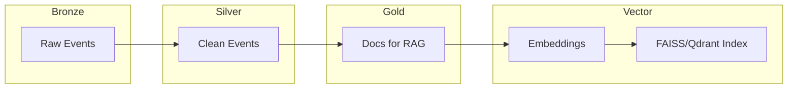

# NILOOMID — AI\_Engineer Grade‑A Blueprint (Combined & Validated)

**Purpose.** Combine all content from `omidsaraf/AI_Engineer` into a single, production‑ready blueprint. Extended for Azure Databricks + Delta/Unity Catalog, Azure DevOps, and Airflow orchestration; adds agentic AI, RAG best practices, governance, CI/CD, observability, and runbooks.

---

## Phase 0 — Repository & Environments

**Repo layout (recommended).**

```
ai-pipeline/
├── dags/                        # Airflow DAGs (orchestrate end-to-end)
│   └── rag_pipeline.py
├── notebooks/                   # Databricks notebooks (DLT, debug)
│   ├── 00_setup_uc.sql
│   ├── 10_autoloader_bronze.py
│   ├── 20_silver_cleaning.py
│   └── 30_gold_kpis.sql
├── src/
│   ├── ingestion.py             # S3/HTTP/ADLS landing
│   ├── validation.py            # Great Expectations suites
│   ├── preprocessing.py         # text clean, chunk, metadata
│   ├── embed.py                 # embeddings + FAISS/Qdrant
│   ├── rag.py                   # retriever/QA chains
│   ├── agent.py                 # LangGraph agent & tools
│   ├── api.py                   # FastAPI service
│   └── utils.py                 # logging, config
├── dlt/                         # Delta Live Tables assets
│   └── pipeline.json
├── docker/
│   ├── airflow/Dockerfile
│   ├── api/Dockerfile
│   └── vector_db/Dockerfile
├── infra/
│   ├── terraform/               # Azure + Databricks + Storage + VNets
│   └── bicep/
├── .github/workflows/ci.yml     # or azure-pipelines.yml
├── requirements.txt
├── docker-compose.yml
└── README.md
```

**Environments.** dev → test → prod with isolated Unity Catalog catalogs, separate resource groups, and per‑stage service principals.

---

## Phase 1 — Cloud & Governance Setup

### Unity Catalog & Lakehouse

```sql
-- 00_setup_uc.sql
CREATE CATALOG IF NOT EXISTS niloomid_ai;
CREATE SCHEMA  IF NOT EXISTS niloomid_ai.raw;
CREATE SCHEMA  IF NOT EXISTS niloomid_ai.clean;
CREATE SCHEMA  IF NOT EXISTS niloomid_ai.gold;

-- RBAC (principals are examples)
GRANT USE CATALOG ON CATALOG niloomid_ai TO `data-engineers`;
GRANT CREATE, USAGE ON SCHEMA niloomid_ai.raw  TO `pipelines`;
GRANT SELECT ON SCHEMA niloomid_ai.gold TO `analysts`;
```

**Secrets & Keys.** Store LLM keys, DB creds in Azure Key Vault; sync to Databricks secret scopes. Lock storage accounts to VNets; use Private Endpoints.

**Mount ADLS Gen2 (Databricks).**

```python
# 00_mount_adls.py (Notebook)
configs = {"fs.azure.account.auth.type": "ManagedIdentity",}
dbutils.fs.mount(
  source="abfss://lake@<storage>.dfs.core.windows.net/",
  mount_point="/mnt/lake",
  extra_configs=configs)
```

---

## Phase 2 — Ingestion (Batch & Streaming)

### Batch (S3/ADLS/HTTP → Bronze)

```python
# src/ingestion.py
import boto3, requests
from pathlib import Path

def download_prefix(bucket: str, prefix: str, dst: Path) -> None:
    s3 = boto3.client('s3')
    paginator = s3.get_paginator('list_objects_v2')
    for page in paginator.paginate(Bucket=bucket, Prefix=prefix):
        for obj in page.get('Contents', []):
            key = obj['Key']
            out = dst / Path(key).relative_to(prefix)
            out.parent.mkdir(parents=True, exist_ok=True)
            s3.download_file(bucket, key, str(out))
```

### Streaming (Autoloader/Kafka → Bronze)

```python
# notebooks/10_autoloader_bronze.py
from pyspark.sql.functions import *
raw = (
  spark.readStream.format("cloudFiles")
  .option("cloudFiles.format", "json")
  .load("/mnt/lake/raw/events/")
)
(raw
  .withColumn("ingest_ts", current_timestamp())
  .writeStream.format("delta")
  .option("checkpointLocation", "/mnt/lake/_chk/bronze/events")
  .toTable("niloomid_ai.raw.events"))
```

---

## Phase 3 — Validation & Cleansing (Great Expectations → Silver)

```python
# src/validation.py
import great_expectations as ge
from great_expectations.core.batch import BatchRequest

def validate_parquet(path: str, suite: str) -> bool:
    context = ge.get_context()
    br = BatchRequest(
        datasource_name="parquet_ds",
        data_connector_name="default_inferred_data_connector_name",
        data_asset_name=path,
        batch_identifiers={"default_identifier_name": "default"},
    )
    v = context.get_validator(batch_request=br, expectation_suite_name=suite)
    res = v.validate(); v.save_expectation_suite(discard_failed_expectations=False)
    v.save_validation_result()
    return res.success
```

**Silver transform.**

```python
# notebooks/20_silver_cleaning.py
from pyspark.sql.functions import col, regexp_replace, trim
bronze = spark.table("niloomid_ai.raw.events")
silver = (bronze
  .withColumn("content", trim(regexp_replace(col("content"), "\s+", " ")))
  .dropDuplicates(["event_id"]))
silver.write.mode("overwrite").saveAsTable("niloomid_ai.clean.events")
```

---

## Phase 4 — Embeddings, Vector Store, and RAG

### Chunking & Embedding

```python
# src/preprocessing.py
import pandas as pd, re

def clean_text(t: str) -> str:
    return re.sub(r"\s+", " ", t or "").replace("\u200b", "").strip()

def split_documents(df: pd.DataFrame, size=512, overlap=50):
    rows = []
    for _, r in df.iterrows():
        w = (r["content"] or "").split(); i = 0
        while i < len(w):
            chunk = " ".join(w[i:i+size])
            rows.append({"doc_id": r["doc_id"], "chunk_text": clean_text(chunk)})
            i += size - overlap
    return pd.DataFrame(rows)
```

```python
# src/embed.py (FAISS local; swap with Qdrant/Azure AI Search in prod)
from sentence_transformers import SentenceTransformer
import numpy as np, faiss
model = SentenceTransformer('all-MiniLM-L6-v2')

def embed_chunks(texts):
    return model.encode(list(texts), normalize_embeddings=True)

def build_index(vecs: np.ndarray):
    idx = faiss.IndexFlatIP(vecs.shape[1]); idx.add(vecs); return idx
```

### RAG Chain

```python
# src/rag.py
from langchain.vectorstores import FAISS
from langchain.chains import RetrievalQA
from langchain.prompts import PromptTemplate
from langchain_openai import ChatOpenAI

def build_qa(retriever):
    tmpl = """Use ONLY the given context. If unknown, say you don't know.\nContext:{context}\nQuestion:{question}\nAnswer:"""
    prompt = PromptTemplate(template=tmpl, input_variables=["context","question"])
    llm = ChatOpenAI(model="gpt-4o-mini", temperature=0)
    return RetrievalQA.from_chain_type(llm=llm, retriever=retriever, chain_type_kwargs={"prompt": prompt})
```

---

## Phase 5 — Agentic AI (LangGraph)

```python
# src/agent.py
from langgraph.graph import StateGraph
from typing import Dict

class S(dict):
    query: str; plan: str; answer: str

g = StateGraph(S)

def plan_node(s):
    s["plan"] = f"search→retrieve→answer for: {s['query']}"; return s

def retrieve_node(s):
    # call retriever (omitted), attach context ids
    s["ctx_ids"] = ["doc:123","doc:456"]; return s

def answer_node(s):
    s["answer"] = f"Final answer based on {s['ctx_ids']}"; return s

g.add_node("plan", plan_node)

g.add_node("retrieve", retrieve_node)

g.add_node("answer", answer_node)

g.set_entry_point("plan"); g.add_edge("plan","retrieve"); g.add_edge("retrieve","answer")
app = g.compile()
```

**Tools.** SQL (Databricks), HTTP (requests), File (Unity Catalog Volumes), Job trigger (Databricks REST) with strict allow‑list.

---

## Phase 6 — API & Serving

```python
# src/api.py
from fastapi import FastAPI
from pydantic import BaseModel
app = FastAPI(title="NILOOMID RAG")

class Msg(BaseModel):
    session_id: str; user: str

@app.post("/chat")
async def chat(m: Msg):
    # qa = build_qa(retriever)  # load at startup in real service
    return {"answer": "stub", "session_id": m.session_id}
```

**Auth.** Protect with Azure AD (OAuth2 on API Management). Add rate limits and circuit breakers.

---

## Orchestration — Airflow DAG & Databricks Workflows

```python
# dags/rag_pipeline.py (sequential, daily)
from airflow import DAG
from airflow.operators.python import PythonOperator
from datetime import datetime, timedelta
from src.ingestion import download_prefix
from src.validation import validate_parquet

with DAG("rag_end_to_end", start_date=datetime(2024,1,1), schedule_interval="@daily", catchup=False,
         default_args={"owner":"de","retries":2,"retry_delay":timedelta(minutes=2)}) as dag:
    ingest = PythonOperator(task_id="ingest", python_callable=lambda: download_prefix("bucket","prefix","/opt/airflow/data"))
    validate = PythonOperator(task_id="validate", python_callable=lambda: validate_parquet("/opt/airflow/data/data.parquet","suite"))
    preprocess = PythonOperator(task_id="preprocess", python_callable=lambda: None)
    embed = PythonOperator(task_id="embed", python_callable=lambda: None)
    deploy = PythonOperator(task_id="deploy_api", python_callable=lambda: None)
    ingest >> validate >> preprocess >> embed >> deploy
```

---

## CI/CD — GitHub Actions (swap for Azure DevOps if preferred)

```yaml
# .github/workflows/ci.yml
name: ci
on: [push]
jobs:
  test-build:
    runs-on: ubuntu-latest
    steps:
      - uses: actions/checkout@v4
      - uses: actions/setup-python@v5
        with: { python-version: '3.11' }
      - run: pip install -r requirements.txt
      - run: pytest -q
      - name: Lint & typecheck
        run: |
          pip install ruff mypy
          ruff check src
          mypy src
      - name: Build API image
        run: |
          docker build -t ghcr.io/niloomid/rag-api:$(git rev-parse --short HEAD) docker/api
```

**Azure DevOps variant.** Use `azure-pipelines.yml` with stages: Test → Build → Deploy (to AKS), integrate Databricks CLI for notebook/job deployment.

---

## DLT Dataflow (Left → Right, no crossing)



---

## Evals & Observability

* **Evals:** ragas (answer\_faithfulness, context\_relevancy), golden Q/A sets; nightly regression.
* **Metrics:** p95 latency, retrieval hit‑rate, chunk coverage, cost per 1k tokens.
* **Tracing:** OpenTelemetry spans `ingest→validate→preprocess→embed→retrieve→llm→respond`.
* **Logging:** JSON logs; PII scrubbing.

```python
# src/utils.py (otel skeleton)
from opentelemetry import trace
tracer = trace.get_tracer("niloomid.ai")
```

---

## Security & Compliance

* RBAC via Unity Catalog; row‑level filters where needed.
* Secrets: Key Vault + Databricks scopes; never store keys in code.
* Data retention: Bronze <30d; Silver 180d; Gold as business requires.
* Network: Private Endpoints; API behind WAF; allow‑list outbound LLM endpoints.

---

## Runbook: Systematic Debugging

| Stage      | What to verify                       | Tools                         |
| ---------- | ------------------------------------ | ----------------------------- |
| Ingestion  | Bytes/object counts; 0‑row files     | S3/ADLS metrics, Airflow XCom |
| Validation | GE suite pass/fail; drift            | GE Data Docs                  |
| Embeddings | vector dim==384/768; ntotal>0        | FAISS/Qdrant stats            |
| Retrieval  | top‑k distribution; score thresholds | similarity histograms         |
| LLM        | rate limits; fallbacks working       | circuit breakers, retries     |

---

## Sample Data

* **CSV (batch):** `data/raw/docs.csv` with `doc_id,content`
* **JSON (stream):** `data/raw/events/ts=<date>/events.json` with `{event_id, content, ts}`

---

## Next Steps (optional hardening)

* Replace FAISS with Azure AI Search / Qdrant managed.
* Add semantic cache (Redis/Upstash) and prompt versioning.
* Add Lakehouse Feature Store for embedding lineage.
* Add Canary deploys via Argo Rollouts; policy checks with OPA/Conftest.

---

