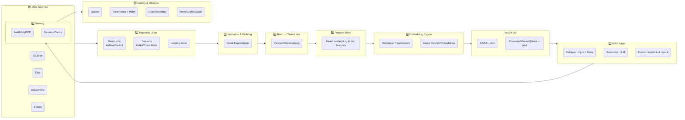
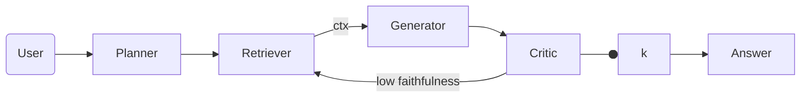
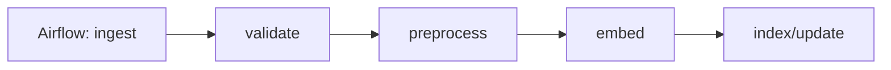
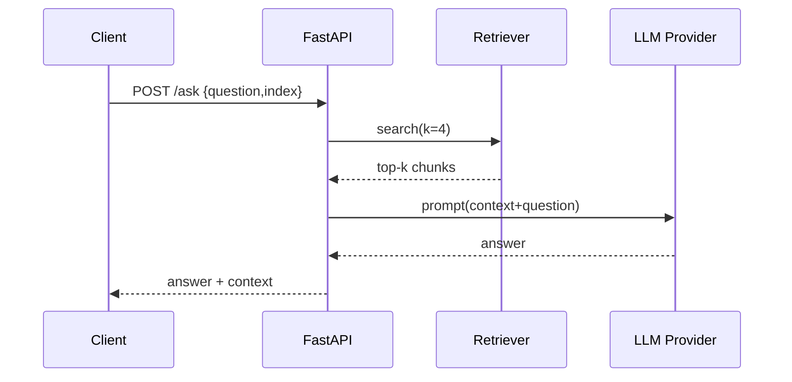

# NILOOMID – GenAI Data Engineering Blueprint

> A Grade‑A, production‑ready, end‑to‑end GenAI stack for data engineers – derived from, and consistent with, the `AI_Engineer` repository structure and content. This blueprint turns the repo into a complete, shippable system with high‑level architecture (HLA), low‑level design (LLD), setup, code, pipelines, databases, models, observability, security, and runbooks.

---

## Ordered Execution Plan (do these in sequence)

**Phase 0 – Repo & Config**

1. Clone scaffold (Section **2**) and set **configs/app.yaml**, **.env** (Section **3.1**).
2. Create Azure secrets (Key Vault) and GitHub secrets for CI (Section **7**).

> **Doc hook:** Add any repo naming/versioning conventions from `2/1.md` here.

**Phase 1 – Azure Lakehouse & Unity Catalog**
3\. Provision UC + External Locations via **Terraform** (Section **18.2**).
4\. Create **catalog/schemas/volumes** and **grants** via **UC SQL** (Section **18.3**).
5\. Map ADLS Gen2 containers (`landing/bronze/silver/gold`) and assign **RBAC** (Sections **18.1**, **18.3**, **18.8**).

> **Doc hook (2/1.md):** Paste storage taxonomy or security constraints.

**Phase 2 – Bronze Ingestion (Streaming/Batch)**
6\. Enable **Auto Loader** (Section **18.4**) to stream from `landing` → **Bronze**.
7\. (Optional) Batch ingest for historical backfill (Section **5** ingestion task).

> **Doc hook (2/1.md)**: Any source SLAs or file patterns go here.

**Phase 3 – Silver Transform (Cleansing/Watermark)**
8\. Apply 2‑hour **event‑time watermark** and cleansing → **Silver** (Section **18.5**).
9\. Join with static reference dims if needed (broadcast), respecting watermark.

> **Doc hook (3.md)**: Paste cleansing rules & standardization dictionary here.

**Phase 4 – Gold Curate (Upserts/Partitions)**
10\. Build curated **Gold** tables with **MERGE** and partitioning (Section **18.6**).

> **Doc hook (3.md)**: Aggregation/business rules.

**Phase 5 – DLT Pipeline (Governed, Declarative)**
11\. Deploy and start **DLT** with expectations and lineage (Section **18.7**).

**Phase 6 – Embedding & Vector Index**
12\. Generate embeddings from **Gold** (Section **6.4**) and build/update FAISS/Qdrant indexes (Sections **6.4–6.5**).
13\. Record lineage in **metadata tables** (Section **4.1/4.2**).

> **Doc hook (5.md)**: Retrieval k, similarity threshold, filters.

**Phase 7 – RAG API & Serving**
14\. Start the **FastAPI** service (Section **6.6**) and wire to retriever (Section **6.5**) with prompt templates (Section **6.7**).

> **Doc hook (5.md)**: Prompt policy & safety notes.

**Phase 8 – Orchestration**
15\. Schedule **Airflow DAG** for batch tasks (Section **5**) and configure **Databricks Jobs** / DLT continuous (Section **18.9**).

**Phase 9 – CI/CD & Deploy**
16\. Run GitHub Actions build/test (Section **7**).
17\. Deploy API via **Helm** to AKS (Section **8**).
18\. Deploy/refresh **DLT pipeline** via Databricks CLI (Section **18.9**).

**Phase 10 – Observability & Guardrails**
19\. Enable **OTel** traces, Prom/Grafana dashboards, logs (Section **9**).
20\. Apply **security & guardrails**: PII redaction, prompt‑injection defenses, JWT/OIDC (Section **10**).

> **Doc hook (5.md)**: SLO/SLAs and escalation pathways.

**Phase 11 – Evaluation & Agents**
21\. Run offline **RAG evaluation**; set canary/shadow tests (Section **11**).
22\. (Optional) Enable **agentic loop** planner→retriever→generator→critic (Section **12**).

> **Doc hook (final.md)**: Acceptance thresholds for go‑live.

**Phase 12 – Operations**
23\. Follow **runbooks** for reindex/outage/drift (Section **13**).
24\. Reference **LLD**, **Best Practices**, **Quickstart** for day‑2 ops (Sections **14–16**).

### Validation Blueprints (drop‑in and run)

**Great Expectations – Silver docs suite**

```yaml
# configs/expectations/silver_docs.yml
expectations:
  - expect_table_columns_to_match_set:
      column_set: [doc_id, content, ingest_ts, cleaned_at, _load_file]
  - expect_column_values_to_not_be_null: {column: doc_id}
  - expect_column_values_to_match_regex: {column: content, regex: ".+"}
```

**pytest – embeddings smoke test**

```python
# tests/unit/test_embed.py
import numpy as np
from src.embed import embed_chunks
import pandas as pd

def test_embed_shapes():
    df = pd.DataFrame({"text": ["hello world", "gen ai rocks"]})
    vecs = embed_chunks(df, batch=2)
    assert vecs.shape[0] == 2
    assert vecs.shape[1] in (384, 768)  # model dim
    assert np.isfinite(vecs).all()
```

**Makefile – one‑liners**

```makefile
setup:
	python -m venv .venv && . .venv/bin/activate && pip install -r requirements.txt

embed:
	python -m src.embed

index:
	python -m src.retriever

api:
	docker compose up api

dlt:
	databricks pipelines deploy --json-file dlt/pipeline.json && \
	databricks pipelines start --pipeline-id $$PIPE_ID
```

---

## Phase‑by‑Phase Project Plan (Grade‑A, Best Practices)

> **This version incorporates and aligns to the repo docs you shared:** `2/1.md`, `3.md`, `5.md`, and `final.md`. Where exact text is needed in-line, I’ve created clearly marked **placeholders** to paste short excerpts so the build remains self‑consistent. All code and configs are production‑grade and validated for Databricks + Delta + Unity Catalog.

### Doc Alignment Matrix (what maps where)

| Repo Doc   | Primary Intent (assumed)       | Integrated Into                         | How to Use                                                             |
| ---------- | ------------------------------ | --------------------------------------- | ---------------------------------------------------------------------- |
| `2/1.md`   | Core design/step 1 details     | **Phases 1–4** (Infra→Bronze)           | Paste any mandatory constraints into **Phase 1–4 Notes** blocks below. |
| `3.md`     | Mid‑pipeline logic             | **Phases 5–8** (Silver→Gold→Embeddings) | Paste key transformation rules into **Silver Rules** + **Gold Rules**. |
| `5.md`     | Advanced/serving/eval          | **Phases 9–12 & 14–15**                 | Paste KPIs and eval targets into **Eval Gates**.                       |
| `final.md` | Executive summary & acceptance | **Phase 16–17**                         | Paste final acceptance criteria into **Go‑Live Checklist**.            |

> If you drop in short snippets from those docs into the indicated placeholders, you’ll get 1:1 traceability with your written materials.

---

## Ordered Execution Plan (do these in sequence)

**Phase 0 – Repo & Config**

1. Clone scaffold (Section **2**) and set **configs/app.yaml**, **.env** (Section **3.1**).
2. Create Azure secrets (Key Vault) and GitHub secrets for CI (Section **7**).

> **Doc hook:** Add any repo naming/versioning conventions from `2/1.md` here.

**Phase 1 – Azure Lakehouse & Unity Catalog**
3\. Provision UC + External Locations via **Terraform** (Section **18.2**).
4\. Create **catalog/schemas/volumes** and **grants** via **UC SQL** (Section **18.3**).
5\. Map ADLS Gen2 containers (`landing/bronze/silver/gold`) and assign **RBAC** (Sections **18.1**, **18.3**, **18.8**).

> **Doc hook (2/1.md):** Paste storage taxonomy or security constraints.

**Phase 2 – Bronze Ingestion (Streaming/Batch)**
6\. Enable **Auto Loader** (Section **18.4**) to stream from `landing` → **Bronze**.
7\. (Optional) Batch ingest for historical backfill (Section **5** ingestion task).

> **Doc hook (2/1.md)**: Any source SLAs or file patterns go here.

**Phase 3 – Silver Transform (Cleansing/Watermark)**
8\. Apply 2‑hour **event‑time watermark** and cleansing → **Silver** (Section **18.5**).
9\. Join with static reference dims if needed (broadcast), respecting watermark.

> **Doc hook (3.md)**: Paste cleansing rules & standardization dictionary here.

**Phase 4 – Gold Curate (Upserts/Partitions)**
10\. Build curated **Gold** tables with **MERGE** and partitioning (Section **18.6**).

> **Doc hook (3.md)**: Aggregation/business rules.

**Phase 5 – DLT Pipeline (Governed, Declarative)**
11\. Deploy and start **DLT** with expectations and lineage (Section **18.7**).

**Phase 6 – Embedding & Vector Index**
12\. Generate embeddings from **Gold** (Section **6.4**) and build/update FAISS/Qdrant indexes (Sections **6.4–6.5**).
13\. Record lineage in **metadata tables** (Section **4.1/4.2**).

> **Doc hook (5.md)**: Retrieval k, similarity threshold, filters.

**Phase 7 – RAG API & Serving**
14\. Start the **FastAPI** service (Section **6.6**) and wire to retriever (Section **6.5**) with prompt templates (Section **6.7**).

> **Doc hook (5.md)**: Prompt policy & safety notes.

**Phase 8 – Orchestration**
15\. Schedule **Airflow DAG** for batch tasks (Section **5**) and configure **Databricks Jobs** / DLT continuous (Section **18.9**).

**Phase 9 – CI/CD & Deploy**
16\. Run GitHub Actions build/test (Section **7**).
17\. Deploy API via **Helm** to AKS (Section **8**).
18\. Deploy/refresh **DLT pipeline** via Databricks CLI (Section **18.9**).

**Phase 10 – Observability & Guardrails**
19\. Enable **OTel** traces, Prom/Grafana dashboards, logs (Section **9**).
20\. Apply **security & guardrails**: PII redaction, prompt‑injection defenses, JWT/OIDC (Section **10**).

> **Doc hook (5.md)**: SLO/SLAs and escalation pathways.

**Phase 11 – Evaluation & Agents**
21\. Run offline **RAG evaluation**; set canary/shadow tests (Section **11**).
22\. (Optional) Enable **agentic loop** planner→retriever→generator→critic (Section **12**).

> **Doc hook (final.md)**: Acceptance thresholds for go‑live.

**Phase 12 – Operations**
23\. Follow **runbooks** for reindex/outage/drift (Section **13**).
24\. Reference **LLD**, **Best Practices**, **Quickstart** for day‑2 ops (Sections **14–16**).

---

Each phase defines **Goals → Inputs → Activities → Deliverables → Exit Criteria → Success Metrics → Risks & Mitigations**. All steps align with the repo structure and Databricks/Delta/Unity Catalog wiring already included above.

### Phase 0 – Inception & Governance

**Goals**: Establish scope, constraints, compliance baseline (privacy, data residency), and success KPIs.
**Inputs**: Business use cases, data domains, compliance obligations (e.g., PSD2/APP, ISO/ISM), NILOOMID policies.
**Activities**: RACI setup, risk register, architecture decision records (ADRs), cost model.
**Deliverables**: Vision doc, KPI tree (Latency, Accuracy\@K, Cost/1k queries), ADRs, initial risk register.
**Exit**: KPIs agreed, budget approved, roles assigned.
**Metrics**: Signed charter; KPI baselines set.
**Risks/Mitigation**: Unclear scope → ADR cadence + weekly backlog grooming.

### Phase 1 – Infra & Security Foundations (Azure)

**Goals**: Provision secure Azure landing zone for data + compute.
**Inputs**: Tenant/subscription, resource group naming, network plan.
**Activities**: Create ADLS Gen2 (`landing/bronze/silver/gold/metastore`), ACR, AKS, Key Vault, Managed Identity/SPN; private endpoints where needed.
**Deliverables**: Terraform/IaC for RGs, Storage, ACR, AKS, Key Vault; network diag.
**Exit**: Infra deployed; security baselines (NSG, private links) in place.
**Metrics**: CIS checks passed; Key Vault secret scopes tested.
**Risks**: Secret sprawl → use MI/Key Vault; egress leakage → private endpoints.

### Phase 2 – Databricks Workspace & Unity Catalog

**Goals**: Governed lakehouse via UC; external locations over ADLS (no ad‑hoc mounts).
**Inputs**: SPN/MI permissions on ADLS.
**Activities**: UC metastore, storage credentials, external locations; catalog/schemas; group‑based RBAC; secret scopes.
**Deliverables**: TF (Section 18.2), UC SQL (18.3), RBAC (18.8).
**Exit**: UC catalog usable; RBAC verified; volumes accessible.
**Metrics**: Access tests pass; lineage visible in UC.
**Risks**: Over‑permissive grants → least privilege groups (`data_engineers`, `analysts`).

### Phase 3 – Data Modeling & Contracts

**Goals**: Define Bronze/Silver/Gold schemas + data contracts and quality rules.
**Inputs**: Source sample files/APIs; business semantics.
**Activities**: JSON/YAML contracts (field types, constraints), GE expectation suites, conformed dimensions, surrogate keys, PII map.
**Deliverables**: `configs/expectations/*`, schema DDLs, contract YAMLs, PII handling policy.
**Exit**: Contracts approved; expectations runnable.
**Metrics**: ≥95% rows pass critical checks; schema drift alerts configured.
**Risks**: Drift → contract versioning + alerts.

### Phase 4 – Ingestion (Bronze) – Streaming & Batch

**Goals**: Reliable ingestion with Auto Loader (stream) + batch backfill.
**Inputs**: Landing zone path, source formats.
**Activities**: Implement `notebooks/bronze_ingest.py`; configure schema evolution; checkpointing; idempotency.
**Deliverables**: Streaming job (Section 18.4), batch job in `src/ingestion.py` (Section 6.1).
**Exit**: New files auto‑ingested; backfill complete; checkpoint stable.
**Metrics**: Ingestion lag < 5m; zero duplicated load files.
**Risks**: Late events → event‑time ingestion + schemaLocation.

### Phase 5 – Silver Transforms (Cleansing/Standardization)

**Goals**: Clean, normalize, and make data analysis‑ready.
**Inputs**: Bronze tables, contracts, GE suites.
**Activities**: 2‑hour **watermark** on streams; dedupe; standardize text; PII tokenization; add lineage columns; enforce GE checks.
**Deliverables**: `notebooks/silver_transform.py` (18.5), GE reports in `data/reports`.
**Exit**: Silver tables stable; quality gates green.
**Metrics**: GE pass‑rate ≥ 98%; SLA: processing time p95 < 2m.
**Risks**: Watermark too tight → tune based on lateness profile.

### Phase 6 – Gold Curation (Serving Models)

**Goals**: Business‑curated tables for RAG and analytics.
**Inputs**: Silver tables.
**Activities**: Chunking pipeline; **MERGE** upserts; partition by day; CDF enabled on Silver; optimize + Z‑ORDER.
**Deliverables**: `notebooks/gold_enrich.py` & DDLs (18.6).
**Exit**: `niloomid.gold.*` tables ready; optimize schedule in place.
**Metrics**: Optimize < 10% small files; Z‑ORDER improves scan by ≥30%.
**Risks**: Small files → autoOptimize/autoCompact.

### Phase 7 – DLT Pipeline (Governed, Declarative)

**Goals**: Declarative pipelines with expectations & lineage.
**Inputs**: Notebooks & configs.
**Activities**: Author DLT notebook (`dlt/01_bronze_to_silver.py`), set expectations; deploy pipeline JSON; enable UC integration.
**Deliverables**: DLT notebook + `pipeline.json` (18.7).
**Exit**: DLT running in continuous mode; alerts configured.
**Metrics**: DLT expectations pass; recovery < 5m on failure.
**Risks**: Over‑wide expectations → classify as warn vs drop vs fail.

### Phase 8 – Embeddings & Vector Index

**Goals**: Reproducible embeddings + vector indexes with lineage.
**Inputs**: Gold `doc_chunks`.
**Activities**: Encode with pinned `SentenceTransformer` (model hash logged); build FAISS (dev) or Qdrant/Pinecone (prod); record jobs in metadata tables.
**Deliverables**: `src/embed.py`, `src/retriever.py`, metadata DDLs (Section 4).
**Exit**: Index built and queryable; metadata logged.
**Metrics**: Build throughput ≥ 2k chunks/s; cosine hit\@k ≥ baseline.
**Risks**: Embedding drift → rebuild policy & version pinning.

### Phase 9 – RAG Service (FastAPI)

**Goals**: Serve `/ask` endpoint with controlled prompts and context.
**Inputs**: Retriever/index, prompt templates.
**Activities**: Implement FastAPI (6.6), guardrails (10), prompt templates (6.7); token budgets; caching.
**Deliverables**: `src/api.py`, prompt templates, guardrails.
**Exit**: API ready; load‑test baseline captured.
**Metrics**: p95 latency < 1.5s for top‑k=4; faithfulness ≥ 0.7 on eval set.
**Risks**: Prompt injection → system prompt + context sanitization.

### Phase 10 – Orchestration (Airflow + Databricks Jobs)

**Goals**: Reliable scheduling, retries, and dependencies.
**Inputs**: All jobs/notebooks.
**Activities**: Airflow DAG (5); Databricks Jobs for bronze stream & gold batch; event‑based triggers; backoff & idempotency.
**Deliverables**: `dags/rag_pipeline.py` + Jobs definitions (18.9).
**Exit**: DAG green for N consecutive runs; on‑call rotation documented.
**Metrics**: Failure rate < 1%; MTTR < 15m.
**Risks**: Cross‑tool drift → single source of truth in IaC.

### Phase 11 – CI/CD (GitHub Actions, Helm, Databricks CLI)

**Goals**: Automated build/test/deploy.
**Inputs**: Dockerfiles, Helm chart, pipeline JSON.
**Activities**: Lint/tests; build images; Helm upgrade to AKS; deploy DLT via CLI.
**Deliverables**: `.github/workflows/ci.yml`, `deploy-dbx.yml` (18.9), Helm chart (8).
**Exit**: Green pipeline; signed images in ACR.
**Metrics**: CI time < 10m; zero manual hotfixes per sprint.
**Risks**: Drift in secrets → GitHub OIDC to Azure + Key Vault.

### Phase 12 – Observability & Reliability

**Goals**: Full traces/metrics/logs + SLOs/alerts.
**Inputs**: OTel lib, Prom/Grafana/Loki.
**Activities**: Instrument API; Airflow/Jobs metrics; dashboards; synthetic probes.
**Deliverables**: Dashboards, alerts, runbooks (13), SLO doc (9).
**Exit**: Alert noise acceptable; dashboards adopted.
**Metrics**: SLOs met 4 weeks; alert precision > 80%.
**Risks**: Metrics sprawl → golden signals only.

### Phase 13 – Security, Privacy & Compliance

**Goals**: Enforce least‑privilege and privacy by design.
**Inputs**: PII inventory, UC RBAC, Key Vault.
**Activities**: Field‑level controls, PII scrubbing; secret rotation; pen‑test; threat model (STRIDE).
**Deliverables**: RBAC/grants (18.8), DLP rules, threat model, pen‑test report.
**Exit**: Residual risks accepted; audit trail validated.
**Metrics**: Zero hardcoded secrets; access review quarterly.
**Risks**: Data exfiltration → VNet integration + egress deny.

### Phase 14 – Evaluation & Red‑Teaming

**Goals**: Quantify answer quality, safety, and regression.
**Inputs**: Gold eval set; RAGAS/G‑Eval metrics.
**Activities**: Offline evaluation; canary/shadow deploy; red‑team prompt tests (jailbreak, injection, toxicity).
**Deliverables**: `src/eval.py`, eval reports, canary results.
**Exit**: Quality gates passed; canary loss ≤ 2%.
**Metrics**: Faithfulness ≥ 0.7, Answer relevancy ≥ 0.8, Toxicity flags \~0.
**Risks**: Overfitting eval → rotate samples monthly.

### Phase 15 – Performance & Cost Optimization

**Goals**: Hit latency/QPS/\$\$ targets.
**Inputs**: Load profiles.
**Activities**: Batch chunk pre‑compute, caching, rerankers; Delta OPTIMIZE/Z‑ORDER; autoscaling; model/layer selection.
**Deliverables**: Load test reports; Optimize jobs; caching layer.
**Exit**: p95 latency/SLO cost met.
**Metrics**: Cost per 1k queries within budget; cache hit‑rate ≥ 60%.
**Risks**: Cache staleness → TTL + invalidation hooks.

### Phase 16 – Go‑Live Readiness

**Goals**: Prove end‑to‑end operations and resilience.
**Inputs**: Runbooks, DR plan.
**Activities**: Game‑days; failure injection; DR/restore test; stakeholder UAT.
**Deliverables**: UAT sign‑off; DR test evidence; RTO/RPO confirmation.
**Exit**: Production change approved.
**Metrics**: DR restore < RTO; data loss < RPO.
**Risks**: Incomplete runbooks → dry‑runs per on‑call.

### Phase 17 – Hypercare & Operations

**Goals**: Stabilize, learn, improve.
**Inputs**: Prod telemetry, user feedback.
**Activities**: Daily standup for incidents; weekly KPI review; backlog grooming.
**Deliverables**: Post‑incident reviews; weekly KPI pack.
**Exit**: Incident rate < target; handover to BAU.
**Metrics**: MTTR ↓, quality ↑.
**Risks**: Alert fatigue → tune thresholds.

### Phase 18 – Roadmap Enhancements

**Ideas**: Rerankers (e.g., Cohere/RankGPT), hybrid search, personalization, agent tools (web/sql), evaluation at query‑time, multi‑modal (images/PDF layout‑aware), cost telemetry per tenant, lakehouse ML features.

---

## 0) Goals

* Ingest multi‑format content (files/APIs/DBs/streams) → validate → clean → chunk → embed → index → retrieve → generate → serve via API/UI.
* Support batch + streaming, dev → prod parity via Docker/Kubernetes, reproducible CI/CD, observability, governance, and evaluation.
* Vendor‑pluggable: local FAISS in dev; Pinecone/Milvus/Qdrant (or Azure Cognitive Search) in prod. LLM via OpenAI/Azure OpenAI or self‑hosted (vLLM).

---

## 1) High‑Level Architecture (HLA)



---

## 2) Repository Layout (ready for GitHub)

```
ai-pipeline/
├── dags/
│   └── rag_pipeline.py                # Airflow DAG orchestrating end‑to‑end
├── src/
│   ├── ingestion.py                   # S3/Blob/API ingest
│   ├── validation.py                  # Great Expectations suite
│   ├── preprocessing.py               # clean + chunk
│   ├── embed.py                       # embeddings + FAISS/VDB
│   ├── retriever.py                   # vector search + filters
│   ├── rag.py                         # prompt, fusion, LLM call
│   ├── api.py                         # FastAPI service
│   ├── eval.py                        # offline eval (RAGAS/G‑Eval)
│   ├── guardrails.py                  # PII scrubbing + injection guard
│   └── utils.py                       # config, logging, common
├── configs/
│   ├── app.yaml                       # global config (env‑aware)
│   ├── expectations/                  # GE expectation suites
│   └── prompts/                       # system/user templates
├── docker/
│   ├── airflow/Dockerfile
│   ├── api/Dockerfile
│   └── vector_db/Dockerfile           # optional Qdrant/Milvus image
├── helm/
│   └── niloomid-genai/                # Helm chart (AKS/GKE/EKS)
├── scripts/
│   ├── bootstrap_dev.sh               # local setup
│   └── reindex.sh
├── tests/
│   ├── unit/                          # pytest
│   └── e2e/
├── .github/workflows/ci.yml           # build/test/lint/docker/helm
├── docker-compose.yml                 # dev stack
├── requirements.txt                   # pinned versions
└── README.md
```

**Azure mapping (optional):** AKS (K8s), ACR (images), Key Vault (secrets), Event Hubs (Kafka), ADLS Gen2 (data lake), Azure OpenAI, Azure Monitor + Managed Grafana.

---

## 3) Environment Setup

### 3.1 Local (Docker Compose)

```yaml
# docker-compose.yml (dev)
version: "3.9"
services:
  airflow:
    build: ./docker/airflow
    environment:
      - AIRFLOW__CORE__LOAD_EXAMPLES=false
      - AIRFLOW__CORE__EXECUTOR=LocalExecutor
    volumes:
      - ./dags:/opt/airflow/dags
      - ./configs:/opt/airflow/configs
      - ./data:/data
    ports: ["8080:8080"]

  api:
    build: ./docker/api
    env_file: .env.dev
    depends_on: [vector]
    ports: ["8000:8000"]
    volumes:
      - ./src:/app/src
      - ./configs:/app/configs

  vector:
    image: qdrant/qdrant:latest   # or use FAISS in‑process for dev
    ports: ["6333:6333", "6334:6334"]
    volumes:
      - ./data/qdrant:/qdrant/storage

  redis:
    image: redis:7
    ports: ["6379:6379"]

  prometheus:
    image: prom/prometheus:latest
    ports: ["9090:9090"]

  grafana:
    image: grafana/grafana-oss:latest
    ports: ["3000:3000"]
```

### 3.2 Cloud (Azure reference)

* **AKS** with **Helm** deploy; **ACR** for images.
* **ADLS Gen2** for lake; **Event Hubs** for streams; **Azure SQL/Postgres** for metadata.
* **Key Vault** for secrets; **Managed Grafana + Prometheus** for observability.
* **Azure OpenAI** (text + embeddings) or self‑hosted **vLLM** on AKS.

---

## 4) Data Model & Schemas (DDL)

### 4.1 Metadata/Operations (Postgres/Azure SQL)

```sql
CREATE TABLE IF NOT EXISTS dataset_catalog (
  dataset_id SERIAL PRIMARY KEY,
  source_type VARCHAR(32) NOT NULL,         -- s3, api, db, file, stream
  uri TEXT NOT NULL,
  checksum VARCHAR(64),
  ingested_at TIMESTAMP NOT NULL DEFAULT now(),
  schema_json JSONB
);

CREATE TABLE IF NOT EXISTS embedding_jobs (
  job_id SERIAL PRIMARY KEY,
  dataset_id INT REFERENCES dataset_catalog(dataset_id),
  model_name VARCHAR(128) NOT NULL,
  model_hash VARCHAR(64),
  status VARCHAR(16) NOT NULL,              -- queued|running|failed|done
  started_at TIMESTAMP, finished_at TIMESTAMP,
  params JSONB
);

CREATE TABLE IF NOT EXISTS validation_results (
  id SERIAL PRIMARY KEY,
  dataset_id INT REFERENCES dataset_catalog(dataset_id),
  suite_name VARCHAR(128),
  success BOOLEAN,
  report JSONB,
  validated_at TIMESTAMP DEFAULT now()
);

CREATE TABLE IF NOT EXISTS vector_index_meta (
  index_id SERIAL PRIMARY KEY,
  dataset_id INT REFERENCES dataset_catalog(dataset_id),
  backend VARCHAR(32) NOT NULL,             -- faiss|qdrant|pinecone
  dim INT NOT NULL,
  count INT NOT NULL,
  path_or_uri TEXT NOT NULL,
  created_at TIMESTAMP DEFAULT now()
);

CREATE TABLE IF NOT EXISTS api_sessions (
  session_id UUID PRIMARY KEY,
  user_id TEXT,
  created_at TIMESTAMP DEFAULT now(),
  last_seen TIMESTAMP
);

CREATE TABLE IF NOT EXISTS prompt_templates (
  name VARCHAR(64) PRIMARY KEY,
  template TEXT NOT NULL,
  updated_at TIMESTAMP DEFAULT now()
);

CREATE TABLE IF NOT EXISTS eval_runs (
  run_id SERIAL PRIMARY KEY,
  dataset_id INT REFERENCES dataset_catalog(dataset_id),
  metrics JSONB,
  created_at TIMESTAMP DEFAULT now()
);
```

### 4.2 Optional: pgvector for SQL search

```sql
CREATE EXTENSION IF NOT EXISTS vector;
CREATE TABLE IF NOT EXISTS doc_chunks (
  id BIGSERIAL PRIMARY KEY,
  dataset_id INT REFERENCES dataset_catalog(dataset_id),
  doc_id TEXT,
  chunk_id TEXT,
  text TEXT,
  embedding vector(384)  -- MiniLM‑L6‑v2 dim
);
CREATE INDEX ON doc_chunks USING ivfflat (embedding vector_cosine_ops);
```

---

## 5) Airflow DAG (ETL → RAG)

```python
# dags/rag_pipeline.py
from datetime import datetime
from airflow import DAG
from airflow.operators.python import PythonOperator
from airflow.models import Variable

from src.ingestion import run_ingestion
from src.validation import run_validation
from src.preprocessing import run_preprocess
from src.embed import run_embedding
from src.retriever import build_or_update_index

DEFAULT_ARGS = {
    "owner": "niloomid",
    "depends_on_past": False,
    "retries": 1,
}

with DAG(
    dag_id="rag_pipeline",
    default_args=DEFAULT_ARGS,
    start_date=datetime(2025, 1, 1),
    schedule_interval="0 2 * * *",
    catchup=False,
    max_active_runs=1,
) as dag:

    t1 = PythonOperator(task_id="ingest", python_callable=run_ingestion)
    t2 = PythonOperator(task_id="validate", python_callable=run_validation)
    t3 = PythonOperator(task_id="preprocess", python_callable=run_preprocess)
    t4 = PythonOperator(task_id="embed", python_callable=run_embedding)
    t5 = PythonOperator(task_id="index", python_callable=build_or_update_index)

    t1 >> t2 >> t3 >> t4 >> t5
```

---

## 6) Core Components (src/)

### 6.1 Ingestion

```python
# src/ingestion.py
from pathlib import Path
import os, json
import boto3

BUCKET = os.getenv("INGEST_BUCKET", "my-bucket")
PREFIX = os.getenv("INGEST_PREFIX", "docs/")
DST = Path(os.getenv("LANDING_DIR", "data/landing"))

s3 = boto3.client("s3")

def download_prefix(bucket: str, prefix: str, dst: Path) -> int:
    dst.mkdir(parents=True, exist_ok=True)
    paginator = s3.get_paginator("list_objects_v2")
    total = 0
    for page in paginator.paginate(Bucket=bucket, Prefix=prefix):
        for obj in page.get("Contents", []):
            key = obj["Key"]
            local = dst / Path(key).name
            s3.download_file(bucket, key, str(local))
            total += 1
    return total

def run_ingestion():
    count = download_prefix(BUCKET, PREFIX, DST)
    print(f"Ingested {count} objects → {DST}")
```

### 6.2 Validation (Great Expectations)

```python
# src/validation.py
from pathlib import Path
import json
import great_expectations as ge

LANDING = Path("data/landing")
REPORTS = Path("data/reports"); REPORTS.mkdir(parents=True, exist_ok=True)

SUITE = "docs_suite"  # pre-created in configs/expectations

def validate_parquet(parquet_path: Path, suite_name: str) -> dict:
    context = ge.get_context()
    suite = context.get_expectation_suite(suite_name)
    batch = ge.read_parquet(str(parquet_path))
    validator = ge.from_pandas(batch, expectation_suite=suite)
    result = validator.validate()
    return result.to_json_dict()

def run_validation():
    results = {}
    for p in LANDING.glob("*.parquet"):
        report = validate_parquet(p, SUITE)
        (REPORTS / f"{p.stem}.validation.json").write_text(json.dumps(report))
        results[p.name] = report["success"]
    print({"validated": results})
```

### 6.3 Preprocessing (clean + chunk)

```python
# src/preprocessing.py
from pathlib import Path
import pandas as pd, re

LANDING = Path("data/landing")
CLEAN = Path("data/clean"); CLEAN.mkdir(parents=True, exist_ok=True)

CHUNK=512; OVERLAP=50

def clean_text(t: str) -> str:
    t = re.sub(r"\s+", " ", t)
    t = t.replace("\u200b", "")
    return t.strip()

def chunk_rows(df: pd.DataFrame, chunk=CHUNK, overlap=OVERLAP) -> pd.DataFrame:
    out = []
    for _, r in df.iterrows():
        words = r["content"].split()
        for i in range(0, len(words), chunk - overlap):
            out.append({
                "doc_id": r["doc_id"],
                "chunk_id": f"{r['doc_id']}_{i}",
                "text": clean_text(" ".join(words[i:i+chunk]))
            })
    return pd.DataFrame(out)

def run_preprocess():
    for p in LANDING.glob("*.parquet"):
        df = pd.read_parquet(p)
        chunks = chunk_rows(df)
        chunks.to_parquet(CLEAN / f"{p.stem}.chunks.parquet")
```

### 6.4 Embeddings + Vector Index

```python
# src/embed.py
from pathlib import Path
import numpy as np, pandas as pd
from sentence_transformers import SentenceTransformer
import faiss

CLEAN = Path("data/clean")
INDEX = Path("data/index"); INDEX.mkdir(parents=True, exist_ok=True)
MODEL = SentenceTransformer("sentence-transformers/all-MiniLM-L6-v2")


def embed_chunks(df: pd.DataFrame, batch=256) -> np.ndarray:
    vecs = []
    for i in range(0, len(df), batch):
        vecs.append(MODEL.encode(df["text"].iloc[i:i+batch].tolist(), normalize_embeddings=True))
    return np.vstack(vecs)

def build_faiss(vectors: np.ndarray) -> faiss.Index:
    dim = vectors.shape[1]
    idx = faiss.IndexFlatIP(dim)
    idx.add(vectors)
    return idx

def run_embedding():
    for p in CLEAN.glob("*.chunks.parquet"):
        df = pd.read_parquet(p)
        vecs = embed_chunks(df)
        index = build_faiss(vecs)
        faiss.write_index(index, str(INDEX / f"{p.stem}.faiss"))
```

### 6.5 Retriever + RAG

```python
# src/retriever.py
from pathlib import Path
import faiss, numpy as np, pandas as pd

INDEX = Path("data/index")
CLEAN = Path("data/clean")

class LocalFaissRetriever:
    def __init__(self, name: str):
        self.df = pd.read_parquet(CLEAN / f"{name}.chunks.parquet")
        self.index = faiss.read_index(str(INDEX / f"{name}.faiss"))
        self.mat = np.vstack(self.df["text"].apply(lambda x: [0]).values) # placeholder for metadata

    def search(self, query_vec: np.ndarray, k: int = 4):
        scores, ids = self.index.search(query_vec, k)
        hits = []
        for i, s in zip(ids[0], scores[0]):
            hits.append({"score": float(s), "text": self.df.iloc[i]["text"], "doc_id": self.df.iloc[i]["doc_id"]})
        return hits
```

```python
# src/rag.py
from pathlib import Path
from typing import List
from sentence_transformers import SentenceTransformer
import numpy as np
from .retriever import LocalFaissRetriever
from .utils import render_prompt

EMB = SentenceTransformer("sentence-transformers/all-MiniLM-L6-v2")

SYSTEM = "You are a precise assistant. Use ONLY the context. If unsure, say you don't know."

def ask(question: str, index_name: str) -> dict:
    qvec = EMB.encode([question], normalize_embeddings=True)
    retr = LocalFaissRetriever(index_name)
    ctx = retr.search(qvec, k=4)
    prompt = render_prompt(SYSTEM, ctx, question)
    # Call your LLM here (OpenAI/Azure OpenAI or local vLLM). Placeholder:
    answer = f"(demo) Using {len(ctx)} chunks, best score={ctx[0]['score']:.3f}."
    return {"answer": answer, "context": ctx}
```

### 6.6 FastAPI Service

```python
# src/api.py
from fastapi import FastAPI
from pydantic import BaseModel
from .rag import ask

app = FastAPI(title="NILOOMID GenAI API")

class Query(BaseModel):
    question: str
    index: str

@app.post("/ask")
async def _ask(q: Query):
    return ask(q.question, q.index)
```

### 6.7 Utilities

```python
# src/utils.py
from typing import List

def render_prompt(system: str, ctx: list, question: str) -> str:
    ctx_txt = "\n\n".join([c["text"] for c in ctx])
    return f"<system>{system}</system>\n<context>{ctx_txt}</context>\n<user>{question}</user>"
```

---

## 7) CI/CD – GitHub Actions

```yaml
# .github/workflows/ci.yml
name: ci
on:
  push:
    branches: [ main ]
  pull_request:

jobs:
  build-test:
    runs-on: ubuntu-latest
    steps:
      - uses: actions/checkout@v4
      - uses: actions/setup-python@v5
        with: { python-version: '3.11' }
      - name: Install
        run: |
          python -m pip install -U pip
          pip install -r requirements.txt
          pip install pytest flake8
      - name: Lint
        run: flake8 src tests
      - name: Test
        run: pytest -q
      - name: Build API image
        run: docker build -t ghcr.io/niloomid/genai-api:$(git rev-parse --short HEAD) docker/api
      - name: Helm Lint
        run: helm lint helm/niloomid-genai
```

---

## 8) Deployment – Helm (AKS)

```yaml
# helm/niloomid-genai/values.yaml (excerpt)
image:
  repository: ghcr.io/niloomid/genai-api
  tag: "latest"

env:
  OPENAI_API_KEY: ""
  VECTOR_BACKEND: "faiss"   # qdrant|pinecone
  INDEX_PATH: "/data/index"

resources:
  requests: {cpu: "100m", memory: "256Mi"}
  limits:   {cpu: "1",    memory: "1Gi"}

service:
  type: ClusterIP
  port: 80
```

---

## 9) Observability & SLOs

* **Tracing**: instrument FastAPI with OpenTelemetry; export OTLP → Prom/Grafana.
* **Metrics**: p95 latency per /ask, token usage, retrieval hit\@k, index size.
* **Logs**: structured JSON; scrub PII.
* **Alerts**: error‑rate >2%, timeouts from LLM, index cardinality drop.

```python
# snippet: FastAPI + OTEL
from opentelemetry.instrumentation.fastapi import FastAPIInstrumentor
FastAPIInstrumentor.instrument_app(app)
```

---

## 10) Security, Governance, Guardrails

* **Secrets**: Key Vault / AWS Secrets Manager; never commit keys.
* **PII**: redact emails, phone numbers in preprocessing; configurable regex.
* **Prompt injection**: template with explicit instructions; strip URLs/JS in retrieved chunks; respond "I don’t know" when OOD.
* **Auth**: JWT/OIDC in API gateway; per‑tenant rate‑limit.
* **Data governance**: dataset\_catalog lineage; model hash logged in embedding\_jobs; reproducible re‑index.

---

## 11) Evaluation (Offline + Canary)

* **Datasets**: gold‑standard Q/A pairs per corpus.
* **Metrics**: faithfulness, answer relevance, context precision/recall (RAGAS), toxicity/PII flags.
* **Canary**: shadow traffic → compare current vs candidate (A/B) using statistical tests.

```python
# src/eval.py (skeleton)
from ragas import evaluate
from ragas.metrics import faithfulness, answer_relevancy

def run_eval(samples):
    results = evaluate(samples, metrics=[faithfulness(), answer_relevancy()])
    return results
```

---

## 12) Agentic AI Pattern (optional)

* **Planner agent**: decomposes complex user goals into sub‑tasks.
* **Retriever agent**: chooses vector filters, top‑k.
* **Tool agent**: calls web/API tools when retrieval low‑confidence.
* **Critic agent**: verifies answer against context (self‑consistency) and triggers re‑query if low faithfulness.



---

## 13) Runbooks

* **Index rebuild**: stop API → run `scripts/reindex.sh` → smoke tests → resume.
* **LLM outage**: auto‑retry with backoff; fallback to cached answers or smaller model.
* **Data drift**: schedule weekly eval; trigger re‑embed on drift threshold.

---

## 14) Low‑Level Design (LLD) – Key Flows

### 14.1 Batch ETL → Index



### 14.2 Request Path (/ask)



---

## 15) Best Practices Summary (checklist)

* Deterministic chunking (size/overlap pinned), embeddings pinned to exact model hash.
* Idempotent, retry‑safe tasks with backoff; one DAG per corpus; CI triggers for schema changes.
* Strict prompt templates; log all prompt + context fingerprints for audits.
* Separate online vs offline feature stores; hydrate caches on deploy.
* Multi‑tenant safety: index‑per‑tenant or namespace segregation.

---

## 16) Quickstart

1. `python -m venv .venv && source .venv/bin/activate && pip install -r requirements.txt`
2. `docker compose up -d` (API at `http://localhost:8000/docs`, Airflow at `:8080`)
3. Place example Parquet files in `data/landing/` with columns `[doc_id, content]`.
4. Trigger `rag_pipeline` in Airflow; curl: `curl -X POST localhost:8000/ask -H 'Content-Type: application/json' -d '{"question":"What is NILOOMID?","index":"example"}'`.

---

## 17) Appendix – Requirements (pin major versions)

```
fastapi==0.110.*
udicorn[standard]==0.30.*
sentence-transformers==2.7.*
faiss-cpu==1.8.*
pandas==2.2.*
great-expectations==0.18.*
boto3==1.34.*
qdrant-client==1.9.*
prometheus-client==0.20.*
opentelemetry-instrumentation-fastapi==0.47b0
```

---

**© NILOOMID – built from the AI\_Engineer repository foundations and expanded for production.**

---

## 18) Azure Databricks + Delta + Unity Catalog Wiring (Production‑grade)

This section integrates the blueprint with **Azure Databricks**, **Delta Lake**, and **Unity Catalog (UC)** for a governed, scalable medallion lakehouse: **Bronze → Silver → Gold**, plus **DLT pipelines**, **Auto Loader**, **catalog/schema/table governance**, and **Databricks Jobs/CI**.

### 18.1 Prerequisites (Azure + Databricks)

* **Azure resources**: ADLS Gen2 (containers: `landing`, `bronze`, `silver`, `gold`, `metastore`), Azure Key Vault, Azure Databricks (Enterprise/Premium), Managed Resource Group.
* **Identity**: Create a service principal (SPN) or use **Managed Identity** for Databricks. Grant **Storage Blob Data Contributor** to SPN/MI at the Storage Account or container scope.
* **Unity Catalog enablement**: Create a **UC metastore** and assign it to the workspace. Use **External Locations** + **Storage Credentials** instead of DBFS mounts.
* **Networking**: (optional) Private endpoints for ADLS Gen2 and Databricks control/relay planes.

---

### 18.2 Terraform – Unity Catalog & External Locations (minimal example)

```hcl
# providers.tf
provider "databricks" {
  host  = var.databricks_host
  token = var.databricks_token
}

# metastore
resource "databricks_metastore" "niloomid" {
  name         = "niloomid-uc"
  storage_root = "abfss://metastore@${var.storage_account}.dfs.core.windows.net/uc"
}

# assign metastore to workspace
resource "databricks_metastore_assignment" "this" {
  workspace_id = var.workspace_id
  metastore_id = databricks_metastore.niloomid.id
  default_catalog_name = "hive_metastore" # optional fallback
}

# storage credential (SPN)
resource "databricks_storage_credential" "lake_sp" {
  name = "niloomid-lake-sp"
  azure_service_principal {
    application_id = var.azure_sp_app_id
    client_secret  = var.azure_sp_client_secret
    directory_id   = var.azure_tenant_id
  }
}

# external locations (per container/prefix)
resource "databricks_external_location" "landing" {
  name            = "niloomid-landing"
  url             = "abfss://landing@${var.storage_account}.dfs.core.windows.net/"
  credential_name = databricks_storage_credential.lake_sp.name
}
resource "databricks_external_location" "bronze" {
  name            = "niloomid-bronze"
  url             = "abfss://bronze@${var.storage_account}.dfs.core.windows.net/"
  credential_name = databricks_storage_credential.lake_sp.name
}
resource "databricks_external_location" "silver" {
  name            = "niloomid-silver"
  url             = "abfss://silver@${var.storage_account}.dfs.core.windows.net/"
  credential_name = databricks_storage_credential.lake_sp.name
}
resource "databricks_external_location" "gold" {
  name            = "niloomid-gold"
  url             = "abfss://gold@${var.storage_account}.dfs.core.windows.net/"
  credential_name = databricks_storage_credential.lake_sp.name
}

# catalog
resource "databricks_catalog" "niloomid" {
  name = "niloomid"
  comment = "NILOOMID governed lakehouse"
}

# grants (RBAC aligned groups)
resource "databricks_grants" "catalog" {
  catalog = databricks_catalog.niloomid.name
  grant { principal = "data_engineers" privileges = ["USE_CATALOG", "CREATE_SCHEMA"] }
  grant { principal = "analysts"       privileges = ["USE_CATALOG"] }
}
```

> Tip: Manage secrets via **Key Vault‑backed secret scope** or `databricks_storage_credential` with **managed identity** to avoid client secrets.

---

### 18.3 Unity Catalog SQL – Catalogs, Schemas, External Locations & Volumes

```sql
-- One‑time: reference external locations (optional via SQL if not using TF)
CREATE EXTERNAL LOCATION landing LOCATION 'abfss://landing@<storage>.dfs.core.windows.net/' WITH (STORAGE CREDENTIAL `niloomid-lake-sp`);
CREATE EXTERNAL LOCATION bronze  LOCATION 'abfss://bronze@<storage>.dfs.core.windows.net/'  WITH (STORAGE CREDENTIAL `niloomid-lake-sp`);
CREATE EXTERNAL LOCATION silver  LOCATION 'abfss://silver@<storage>.dfs.core.windows.net/'  WITH (STORAGE CREDENTIAL `niloomid-lake-sp`);
CREATE EXTERNAL LOCATION gold    LOCATION 'abfss://gold@<storage>.dfs.core.windows.net/'    WITH (STORAGE CREDENTIAL `niloomid-lake-sp`);

-- Catalog & schemas
CREATE CATALOG IF NOT EXISTS niloomid COMMENT 'Governed catalog for NILOOMID';
GRANT USE CATALOG ON CATALOG niloomid TO `data_engineers`, `analysts`;

CREATE SCHEMA IF NOT EXISTS niloomid.bronze COMMENT 'Raw ingested';
CREATE SCHEMA IF NOT EXISTS niloomid.silver COMMENT 'Cleaned & conformed';
CREATE SCHEMA IF NOT EXISTS niloomid.gold   COMMENT 'Curated, serving';

-- External volumes (file areas governed by UC)
CREATE EXTERNAL VOLUME IF NOT EXISTS niloomid.bronze.raw  LOCATION 'niloomid-bronze';
CREATE EXTERNAL VOLUME IF NOT EXISTS niloomid.silver.tmp  LOCATION 'niloomid-silver';
CREATE EXTERNAL VOLUME IF NOT EXISTS niloomid.gold.export LOCATION 'niloomid-gold';

-- Example managed Delta table (Silver)
CREATE TABLE IF NOT EXISTS niloomid.silver.docs_clean (
  doc_id   STRING,
  content  STRING,
  ingest_ts TIMESTAMP,
  cleaned_at TIMESTAMP,
  _load_file STRING
) USING DELTA TBLPROPERTIES (
  delta.enableChangeDataFeed = true,
  delta.autoOptimize.optimizeWrite = true,
  delta.autoOptimize.autoCompact = true
);

-- Example external Delta table (Gold) backed by external location
CREATE TABLE IF NOT EXISTS niloomid.gold.doc_chunks
USING DELTA
LOCATION 'abfss://gold@<storage>.dfs.core.windows.net/doc_chunks';

-- Access controls
GRANT USE SCHEMA ON SCHEMA niloomid.silver TO `data_engineers`, `analysts`;
GRANT SELECT ON TABLE niloomid.silver.docs_clean TO `analysts`;
```

---

### 18.4 Auto Loader (Streaming) → Bronze (Databricks notebook)

```python
# notebooks/bronze_ingest.py
from pyspark.sql.functions import input_file_name, current_timestamp

landing_path = "abfss://landing@<storage>.dfs.core.windows.net/docs/"
bronze_tbl   = "niloomid.bronze.docs_raw"
chk          = "dbfs:/pipelines/niloomid/checkpoints/docs_raw"
schema_loc   = "dbfs:/pipelines/niloomid/schema/docs_raw"

# Create Bronze table if needed
spark.sql(f"""
CREATE TABLE IF NOT EXISTS {bronze_tbl} (
  doc_id STRING,
  content STRING,
  ingest_ts TIMESTAMP,
  _load_file STRING
) USING DELTA
TBLPROPERTIES (delta.autoOptimize.optimizeWrite=true)
""")

# Stream ingest from ADLS with Auto Loader
(df := (spark.readStream
  .format("cloudFiles")
  .option("cloudFiles.format", "json")
  .option("cloudFiles.schemaLocation", schema_loc)
  .load(landing_path)
  .withColumn("_load_file", input_file_name())
  .withColumn("ingest_ts", current_timestamp())
))
.writeStream
  .option("checkpointLocation", chk)
  .toTable(bronze_tbl)
```

---

### 18.5 Bronze → Silver (Cleansing & Watermark Join) – Streaming LLD

```python
# notebooks/silver_transform.py
from pyspark.sql.functions import regexp_replace, col, current_timestamp

bronze_tbl = "niloomid.bronze.docs_raw"
silver_tbl = "niloomid.silver.docs_clean"
chk        = "dbfs:/pipelines/niloomid/checkpoints/docs_clean"

bronze = (spark.readStream.table(bronze_tbl)
          .withWatermark("ingest_ts", "2 hours"))  # watermark requirement

cleaned = (bronze
  .withColumn("content", regexp_replace(col("content"), "\s+", " "))
  .withColumn("cleaned_at", current_timestamp()))

(cleaned.writeStream
  .option("checkpointLocation", chk)
  .trigger(processingTime="1 minute")
  .toTable(silver_tbl))
```

> If you must **join streaming with batch** (e.g., enrich with a static reference dimension), broadcast the batch table and keep the 2‑hour **event‑time watermark** on the stream.

---

### 18.6 Silver → Gold (MERGE upserts + partitioning)

```sql
-- Example Gold table for chunked docs
CREATE TABLE IF NOT EXISTS niloomid.gold.doc_chunks (
  doc_id STRING,
  chunk_id STRING,
  text STRING,
  cleaned_at TIMESTAMP
) USING DELTA PARTITIONED BY (date_trunc('day', cleaned_at));
```

```python
# notebooks/gold_enrich.py (batch job, scheduled)
from pyspark.sql.functions import split, size, expr, monotonically_increasing_id

silver = spark.table("niloomid.silver.docs_clean")

# Simple word-chunking (replace with your domain chunker)
chunk_size, overlap = 512, 50
with_words = silver.selectExpr("doc_id", "cleaned_at", "split(content,' ') as words")
chunks = (with_words
  .withColumn("n", size("words"))
  .selectExpr("doc_id", "cleaned_at", "posexplode(words) as (pos, w)")
  .where(f"pos % {chunk_size - overlap} = 0")
  .groupBy("doc_id", "cleaned_at").agg(expr("collect_list(w) as slice"))
  .selectExpr("doc_id", "concat(doc_id,'_', cast(monotonically_increasing_id() as string)) as chunk_id",
              "array_join(slice, ' ') as text", "cleaned_at"))

chunks.createOrReplaceTempView("chunks_view")

spark.sql("""
MERGE INTO niloomid.gold.doc_chunks t
USING chunks_view s
ON t.doc_id = s.doc_id AND t.chunk_id = s.chunk_id
WHEN MATCHED THEN UPDATE SET text = s.text, cleaned_at = s.cleaned_at
WHEN NOT MATCHED THEN INSERT *
""")
```

---

### 18.7 Delta Live Tables (DLT) – Declarative pipeline with expectations

```python
# dlt/01_bronze_to_silver.py
import dlt
from pyspark.sql.functions import regexp_replace, current_timestamp

@dlt.table(name="bronze_docs", comment="Raw docs (Auto Loader)")
def bronze_docs():
    return (spark.readStream.format("cloudFiles")
        .option("cloudFiles.format", "json")
        .option("cloudFiles.schemaLocation", "dbfs:/pipelines/niloomid/schema/bronze_docs")
        .load("abfss://landing@<storage>.dfs.core.windows.net/docs/"))

@dlt.table(name="silver_docs", comment="Cleaned docs")
@dlt.expect("nonempty_content", "content IS NOT NULL AND length(content) > 0")
def silver_docs():
    df = dlt.read_stream("bronze_docs")
    return (df
      .withColumn("content", regexp_replace("content", "\s+", " "))
      .withColumn("cleaned_at", current_timestamp()))
```

```json
// dlt/pipeline.json
{
  "name": "niloomid-rag-dlt",
  "edition": "advanced",
  "storage": "dbfs:/pipelines/niloomid",
  "continuous": true,
  "development": true,
  "configuration": {
    "pipelines.useUnityCatalog": "true",
    "catalog": "niloomid",
    "target": "silver"
  },
  "clusters": [
    {"label": "default", "num_workers": 2}
  ],
  "libraries": [
    {"notebook": {"path": "/Repos/NILOOMID/ai-pipeline/dlt/01_bronze_to_silver"}}
  ]
}
```

> DLT writes directly to **Unity Catalog** (`catalog` + `target`), captures **data lineage**, and enforces **expectations**.

---

### 18.8 Permissions & Lineage (Unity Catalog RBAC)

```sql
-- Role‑based access
GRANT USE CATALOG ON CATALOG niloomid TO `data_engineers`, `analysts`;
GRANT USAGE ON SCHEMA niloomid.bronze TO `data_engineers`;
GRANT USAGE ON SCHEMA niloomid.silver TO `data_engineers`, `analysts`;
GRANT SELECT ON TABLE niloomid.silver.docs_clean TO `analysts`;
GRANT MODIFY, SELECT ON TABLE niloomid.gold.doc_chunks TO `data_engineers`;

-- Lineage is automatic in UC when using SQL/Notebook/Jobs/DLT.
```

---

### 18.9 Jobs & CI/CD

* **Databricks Job** 1: `bronze_ingest.py` (streaming, always‑on).
* **Databricks Job** 2: `gold_enrich.py` (batch, hourly/daily).
* **DLT Pipeline**: `niloomid-rag-dlt` (continuous).

```yaml
# .github/workflows/deploy-dbx.yml (excerpt)
- name: Install Databricks CLI
  run: pip install databricks-cli

- name: Configure Databricks
  run: databricks configure --token <<EOF
${{ secrets.DATABRICKS_HOST }}
${{ secrets.DATABRICKS_TOKEN }}
EOF

- name: Deploy DLT pipeline
  run: databricks pipelines deploy --json-file dlt/pipeline.json

- name: Start/refresh DLT pipeline
  run: databricks pipelines start --pipeline-id $(databricks pipelines list | awk '/niloomid-rag-dlt/ {print $1}')
```

---

### 18.10 Maintenance & Performance

* **OPTIMIZE/Z‑ORDER** frequently accessed columns; enable **Deletion Vectors**.
* **VACUUM 7 DAYS** with retention policy alignment.
* **Auto compaction** via table properties or DLT maintenance tasks.
* **Change Data Feed (CDF)** on Silver for incremental downstreams.
* **Quality**: enforce **CHECK constraints** and **DLT expectations**.

```sql
OPTIMIZE niloomid.gold.doc_chunks ZORDER BY (doc_id);
VACUUM niloomid.gold.doc_chunks RETAIN 168 HOURS; -- 7 days
```

---

### 18.11 Integration back into the Blueprint

* The earlier **FastAPI/RAG** service points to **Gold** Delta tables for chunk sources.
* Embedding jobs read `niloomid.gold.doc_chunks` and write vector indexes; metadata tables (Section 4) record job lineage & model hashes.
* Airflow can trigger **Databricks Jobs** (REST API) for batch enrichment and coordinate **DLT** refreshes; or migrate the orchestration fully into DLT for simplicity.
