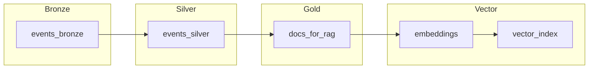

# NILOOMID — Telco-Grade AI\_Engineer Blueprint (Refined 44.md)

**Scope.** World-class big-data/RAG blueprint on Azure Databricks: production governance with Unity Catalog, network-isolated storage, DLT pipelines, Great Expectations, ABAC/RBAC, Airflow orchestration, CI/CD, observability, and evals for RAG. Catalogs are the primary isolation unit; schemas organize domains; use ABAC governed tags for policy-driven access. ([Microsoft Learn][1])

---

## 0) High-Level Architecture (HLA)

```mermaid
flowchart LR
  subgraph Sources
    s1[BSS/CRM (SFDC)]
    s2[OSS/Network xDR]
    s3[Docs/Wikis/Policies]
  end

  subgraph Landing (ADLS Gen2)
    l1[Raw Zone]
  end

  subgraph Lakehouse (Unity Catalog)
    b1[Bronze - raw.delta]
    s1v[Silver - cleansed.delta]
    g1[Gold - curated.delta]
  end

  subgraph Vector & LLM
    v1[Chunking + Embeddings]
    v2[Vector Index (FAISS/Qdrant)]
    r1[RAG Retrieval + LLM]
  end

  subgraph Serving & Ops
    api[FastAPI/AKS]
    obs[Observability (OTel)]
    eval[Evals (ragas)]
  end

  s1 --> l1
  s2 --> l1
  s3 --> l1
  l1 --> b1 --> s1v --> g1 --> v1 --> v2 --> r1 --> api
  r1 --> eval
  api --> obs
```

**Mermaid note:** left-to-right, no crossing edges; labels avoid special characters that break Mermaid parsers.

---

## 1) Governance & Security (Unity Catalog, ABAC, Network)

**Unity Catalog structure (per-environment isolation).** Use a metastore per region; **catalog per environment** (`niloomid_dev`, `niloomid_test`, `niloomid_prod`), schemas per layer/domain (`raw`, `clean`, `gold`). Catalogs are your isolation boundary. ([Microsoft Learn][1])

```sql
-- 00_uc_setup.sql
CREATE CATALOG IF NOT EXISTS niloomid_prod;
CREATE SCHEMA  IF NOT EXISTS niloomid_prod.raw;
CREATE SCHEMA  IF NOT EXISTS niloomid_prod.clean;
CREATE SCHEMA  IF NOT EXISTS niloomid_prod.gold;

-- RBAC (examples)
GRANT USE CATALOG ON CATALOG niloomid_prod TO `data-engineers`;
GRANT USAGE, CREATE ON SCHEMA niloomid_prod.raw  TO `pipelines`;
GRANT SELECT ON SCHEMA niloomid_prod.gold TO `analysts`;
```

**ABAC & governed tags.** Tag data with `PII_CLASS` (NONE|LOW|HIGH), `GEO` (AU), `RETENTION` (30d|180d|2y). Use ABAC policies to enforce masks and row filters across assets. ([Microsoft Learn][2])

```sql
-- Example dynamic view for PII masking
CREATE OR REPLACE VIEW niloomid_prod.clean.customers_masked AS
SELECT
  customer_id,
  CASE WHEN is_member('analysts_pii')
       THEN email
       ELSE regexp_replace(email,'(^.).*(@.*$)','\\1***\\2')
  END AS email,
  CASE WHEN is_member('analysts_pii')
       THEN phone
       ELSE concat(substr(phone,1,2),'****',substr(phone,-2,2))
  END AS phone,
  other_cols
FROM niloomid_prod.clean.customers;
```

**Network controls.** Private Endpoints to ADLS/Key Vault; workspace with no public IPs; egress allow-list only to LLM endpoints; secrets in Key Vault + Databricks scopes; enforce cluster policies (no open-internet, GPU only where needed).

---

## 2) Ingestion (Batch + Streaming) → Bronze

**Batch (S3/ADLS/HTTP landing → Bronze).**

```python
# src/ingestion.py
from pathlib import Path
import boto3, requests, os

def download_prefix(bucket: str, prefix: str, dst: Path) -> None:
    s3 = boto3.client("s3")
    paginator = s3.get_paginator("list_objects_v2")
    for page in paginator.paginate(Bucket=bucket, Prefix=prefix):
        for obj in page.get("Contents", []):
            key = obj["Key"]
            out = dst / Path(key).relative_to(prefix)
            out.parent.mkdir(parents=True, exist_ok=True)
            s3.download_file(bucket, key, str(out))
```

**Streaming (Auto Loader/Kafka → Bronze).** Use schema inference + evolution and checkpointing. In DLT, capture expectations at the edge. ([Microsoft Learn][3])

```python
# notebooks/10_autoloader_bronze.py
from pyspark.sql.functions import current_timestamp
raw = (spark.readStream.format("cloudFiles")
       .option("cloudFiles.format","json")
       .option("cloudFiles.schemaLocation","/mnt/lake/_schemas/events")
       .load("/mnt/lake/raw/events/"))

(raw.withColumn("ingest_ts", current_timestamp())
    .writeStream.format("delta")
    .option("checkpointLocation","/mnt/lake/_chk/bronze/events")
    .toTable("niloomid_prod.raw.events"))
```

---

## 3) Data Quality & Cleansing → Silver

**Great Expectations suites** per table (schema, nulls, ranges). Treat suites as versioned assets; run inline in Airflow/Jobs before Silver writes. ([Great Expectations][4])

```python
# src/validation.py
import great_expectations as ge
from great_expectations.core.batch import BatchRequest

def validate_parquet(path: str, suite: str) -> bool:
    context = ge.get_context()
    br = BatchRequest(
        datasource_name="parquet_ds",
        data_connector_name="default_inferred_data_connector_name",
        data_asset_name=path,
        batch_identifiers={"default_identifier_name":"default"},
    )
    v = context.get_validator(batch_request=br, expectation_suite_name=suite)
    res = v.validate()
    v.save_expectation_suite(discard_failed_expectations=False)
    v.save_validation_result()
    return res.success
```

**Silver transform (dedup, standardize).**

```python
# notebooks/20_silver_cleaning.py
from pyspark.sql.functions import col, trim, regexp_replace
bronze = spark.table("niloomid_prod.raw.events")
silver = (bronze
  .withColumn("content", trim(regexp_replace(col("content"), "\\s+"," ")))
  .dropDuplicates(["event_id"]))
silver.write.mode("overwrite").saveAsTable("niloomid_prod.clean.events")
```

---

## 4) Gold Curation + RAG Prep

**Chunking + embeddings → vector store.**

```python
# src/preprocessing.py
import pandas as pd, re

def clean_text(t: str) -> str:
    return re.sub(r"\s+"," ", t or "").strip()

def split_documents(df: pd.DataFrame, size=512, overlap=64):
    out = []
    for _, r in df.iterrows():
        words = (r["content"] or "").split()
        i = 0
        while i < len(words):
            chunk = " ".join(words[i:i+size])
            out.append({"doc_id": r["doc_id"], "chunk_text": clean_text(chunk)})
            i += size - overlap
    return pd.DataFrame(out)
```

```python
# src/embed.py (FAISS — swap to Qdrant/Azure AI Search in prod)
from sentence_transformers import SentenceTransformer
import numpy as np, faiss
model = SentenceTransformer("all-MiniLM-L6-v2")

def embed_chunks(texts):
    return model.encode(list(texts), normalize_embeddings=True)

def build_index(vecs: np.ndarray):
    idx = faiss.IndexFlatIP(vecs.shape[1]); idx.add(vecs); return idx
```

**RAG chain (strict grounding).**

```python
# src/rag.py
from langchain.vectorstores import FAISS
from langchain.chains import RetrievalQA
from langchain.prompts import PromptTemplate
from langchain_openai import ChatOpenAI

def build_qa(retriever):
    tmpl = "Use ONLY the given context. If unknown, say you don't know.\nContext:{context}\nQuestion:{question}\nAnswer:"
    prompt = PromptTemplate(template=tmpl, input_variables=["context","question"])
    llm = ChatOpenAI(model="gpt-4o-mini", temperature=0)
    return RetrievalQA.from_chain_type(llm=llm, retriever=retriever, chain_type_kwargs={"prompt": prompt})
```

---

## 5) Delta Live Tables (DLT) — Declarative Flow

**Why DLT:** managed orchestration, expectations, quality metrics; follow Databricks best practices for pipeline compute and expectations. ([Databricks Community][5], [Microsoft Learn][3])

```json
{
  "name": "niloomid-rag-dlt",
  "storage": "/mnt/lake/_pipelines/rag",
  "clusters": [{"num_workers": 3}],
  "continuous": true,
  "libraries": [{"notebook": {"path": "/Repos/niloomid/notebooks/10_autoloader_bronze"}}],
  "configuration": {
    "pipelines.expectations": "fail"
  }
}
```

**DLT diagram (left → right).**



---

## 6) Airflow Orchestration (one DAG, sequenced)

```python
# dags/rag_pipeline.py
from airflow import DAG
from airflow.operators.bash import BashOperator
from datetime import datetime

with DAG("rag_pipeline", start_date=datetime(2025,1,1), schedule="0 * * * *", catchup=False) as dag:
  ingest   = BashOperator(task_id="ingest_batch", bash_command="python -m src.ingestion")
  validate = BashOperator(task_id="validate_ge",   bash_command="python -m src.validation")
  dlt_upd  = BashOperator(task_id="run_dlt",       bash_command="databricks pipelines run --pipeline-id $DLT_ID")
  embed    = BashOperator(task_id="embed_docs",    bash_command="python -m src.embed")
  evals    = BashOperator(task_id="run_evals",     bash_command="python -m tests.eval_ragas")
  deploy   = BashOperator(task_id="deploy_api",    bash_command="kubectl rollout restart deploy rag-api")

  ingest >> validate >> dlt_upd >> embed >> evals >> deploy
```

---

## 7) Evals & Observability

**RAG metrics:** use *faithfulness* and *answer relevance*; nightly regression with golden Q/A. ([docs.ragas.io][6])

```python
# tests/eval_ragas.py (sketch)
from ragas.metrics import faithfulness, answer_relevancy
# compute scores on a sample set, assert thresholds; fail pipeline if below targets
```

**OpenTelemetry tracing:** instrument the path `ingest → validate → preprocess → embed → retrieve → llm → respond`. ([OpenTelemetry][7])

```python
# src/utils_obs.py
from opentelemetry import trace
tracer = trace.get_tracer("niloomid.ai")

def traced(stage):
    def deco(f):
        def wrapped(*a, **kw):
            with tracer.start_as_current_span(stage):
                return f(*a, **kw)
        return wrapped
    return deco
```

---

## 8) CI/CD (GitHub Actions or Azure DevOps)

```yaml
# .github/workflows/ci.yml
name: ci
on: [push]
jobs:
  test-build:
    runs-on: ubuntu-latest
    steps:
      - uses: actions/checkout@v4
      - uses: actions/setup-python@v5
        with: { python-version: '3.11' }
      - run: pip install -r requirements.txt
      - run: pytest -q
      - name: Lint & typecheck
        run: |
          pip install ruff mypy
          ruff check src
          mypy src
      - name: Build API image
        run: docker build -t ghcr.io/niloomid/rag-api:${{ github.sha }} docker/api
```

**Databricks deploy:** include notebook/job deployment via CLI or Asset Bundles; pipeline promote only on eval thresholds met.

---

## 9) Telco-Grade Non-Functionals (Optus-style)

* **Data classification:** tag PII, CDR, sensitive ops data; ABAC policies enforce masking/filters across the catalog. ([Microsoft Learn][2])
* **Retention:** Bronze ≤30d; Silver 180d; Gold per product needs; auto-vacuum + Z-order on hot tables.
* **Lineage & audit:** Unity Catalog lineage + access logs; DLT expectations exported to a central DQ dashboard. ([Microsoft Learn][8])
* **SLA/SLO examples:** p95 API latency ≤2.5s; retrieval hit-rate ≥0.85; faithfulness ≥0.75.
* **Network:** Private Links to storage/Key Vault; egress allow-list; no public IPs.
* **Secrets:** Key Vault + scopes; never in code or notebooks.
* **Cluster policy:** no public networks; pinned runtimes; GPU pools only for embedding/LLM phases.

---

## 10) Validation Gates (promote only if “PASS”)

| Stage     | Inputs         | Check                                 | Accept                         |
| --------- | -------------- | ------------------------------------- | ------------------------------ |
| Ingestion | landed objects | File counts > 0; schema inferred      | PASS                           |
| DQ        | GE suite       | All critical expectations pass        | PASS ([Great Expectations][4]) |
| DLT       | pipeline run   | No failed expectations; low drop rate | PASS ([Microsoft Learn][3])    |
| RAG Eval  | golden Q/A     | Faithfulness ≥ 0.75; Relevancy ≥ 0.85 | PASS ([docs.ragas.io][6])      |
| Perf      | load test      | p95 ≤ 2.5s; cost budget respected     | PASS                           |
| Security  | policy check   | ABAC tags present; masks active       | PASS ([Microsoft Learn][2])    |

---

## 11) Sample Data Contracts

* **Batch CSV (docs):** `data/raw/docs.csv` → `doc_id, content`
* **Stream JSON (events):** `data/raw/events/ts=<date>/events.json` → `{event_id, content, ts}`

---

## 12) Runbook (fast triage)

| Symptom                | Where to look      | Action                                                                      |
| ---------------------- | ------------------ | --------------------------------------------------------------------------- |
| No new gold docs       | DLT run page       | Inspect expectations / dead-letter; reprocess window                        |
| Low retrieval hit-rate | Vector stats       | Adjust chunk size/overlap; re-embed hot docs                                |
| Low faithfulness       | Prompt & retriever | Increase top-k; tighten prompt; penalize hallucination ([docs.ragas.io][6]) |
| High latency           | API + model        | Add semantic cache; batch retrieval; autoscale                              |

---

## 13) Repo Layout (recommended)

```
ai-pipeline/
├─ dags/rag_pipeline.py
├─ notebooks/
│  ├─ 00_uc_setup.sql
│  ├─ 10_autoloader_bronze.py
│  ├─ 20_silver_cleaning.py
│  └─ 30_gold_kpis.sql
├─ src/
│  ├─ ingestion.py  ├─ validation.py  ├─ preprocessing.py
│  ├─ embed.py      ├─ rag.py         ├─ api.py
│  └─ utils_obs.py
├─ dlt/pipeline.json
├─ infra/terraform/…
├─ docker/airflow/*  docker/api/*
└─ .github/workflows/ci.yml
```

---

