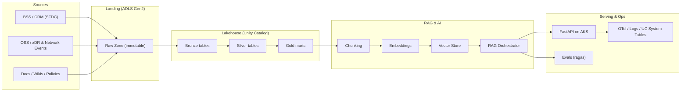
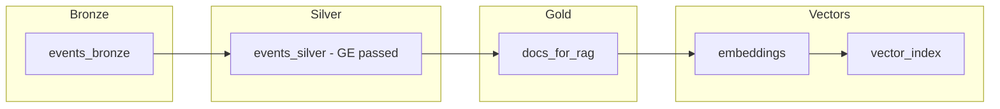

# NILOOMID — AI Engineer Blueprint (All-in-One)

**Goal.** Production blueprint for a secure, governed, high-throughput **Azure Databricks + Unity Catalog** lakehouse powering batch+stream, DLT pipelines, Great Expectations DQ, **RAG** (vector search), Airflow orchestration, OTel observability, and CI/CD — aligned to telco privacy & PII controls. **Catalogs are the primary isolation unit; schemas organize domains**; apply governed tags with **ABAC** for scalable row/column protection. ([Databricks Documentation][1], [Azure Docs][2])

---

## 0) High-Level Architecture (HLA)



**Why this shape:** Unity Catalog for isolation/governance & lineage; DLT for declarative ETL with expectations; Great Expectations for pre-Silver DQ; Private networking and Key Vault secrets; vector index in **Azure AI Search** or **Qdrant**; OTel traces; UC system tables for audit. ([Microsoft Learn][3], [Great Expectations][4], [Databricks Documentation][5])

---

## 1) System Design (LLDs by Layer)

### 1.1 Landing → Bronze (Ingestion)

* **Batch:** ADLS Gen2 landing paths by domain/date; Auto Loader for schema inference/evolution; file notification; checkpoints in dedicated `_chk` path. ([Microsoft Learn][6])
* **Streaming:** Kafka or landing-as-stream via Auto Loader; enforce idempotence and exactly-once semantics with Delta. ([Databricks Documentation][7])
* **CDF:** enable Delta **Change Data Feed** on Bronze for incremental downstream propagation. ([Microsoft Learn][8], [Databricks Documentation][9])

```python
# notebooks/10_bronze_ingest_autoloader.py
from pyspark.sql.functions import current_timestamp
bronze = (spark.readStream.format("cloudFiles")
  .option("cloudFiles.format","json")
  .option("cloudFiles.schemaLocation","/mnt/lake/_schemas/events")
  .load("/mnt/lake/raw/events/"))
(bronze.withColumn("ingest_ts", current_timestamp())
 .writeStream.format("delta")
 .option("checkpointLocation","/mnt/lake/_chk/bronze/events")
 .toTable("niloomid_prod.raw.events"))
```

### 1.2 Bronze → Silver (Cleansing & DQ)

* **GE gate before write:** schema, nulls, ranges; fail pipeline on critical expectations. ([Great Expectations][4])
* **Standardize & dedup:** trim, canonicalize IDs, drop duplicates on business keys.
* **Partitioning:** pragmatic (date/tenant); use predictive optimization/OPTIMIZE/Z-ORDER where helpful; VACUUM cadence per SLA. ([Microsoft Learn][10], [kb.databricks.com][11])

```python
# notebooks/20_silver_clean.py
from pyspark.sql.functions import col, trim, regexp_replace
bronze = spark.table("niloomid_prod.raw.events")
silver = (bronze
  .withColumn("content", trim(regexp_replace(col("content"), r"\s+"," ")))
  .dropDuplicates(["event_id"]))
silver.write.mode("overwrite").saveAsTable("niloomid_prod.clean.events")
```

### 1.3 Silver → Gold (Curation & Serving)

* **Dim/Fact models** per product team; enable **CDF** on Silver to compute Gold incrementally. ([Microsoft Learn][8])
* **RAG-prep:** create `gold.docs` with normative text; chunk & embed; ship to vector store. **Azure AI Search** offers managed vector indexes; Qdrant is an OSS alternative; FAISS for in-memory/local. ([Microsoft Learn][12], [qdrant.tech][13], [faiss.ai][14])

---

## 2) Security & Governance (Optus-grade)

### 2.1 Unity Catalog Layout & ABAC

* **One metastore/region**, **catalog per environment** (`niloomid_dev|test|prod`), schemas per layer/domain; **catalog-level managed storage** preferred for isolation. ([Databricks Documentation][1])
* **ABAC governed tags**: `PII_CLASS`, `RETENTION`, `GEO`; central policies mask/filter without per-table duplication. ([Databricks Documentation][15])

### 2.2 Row-Level & Column-Level Security

Use **row filters** and **column masks** (CLS) with UC functions; fallback to dynamic views for complex logic. ([Microsoft Learn][16], [Databricks Documentation][17], [Azure Docs][18])

```sql
-- Example: column mask for email + row filter by market
CREATE OR REPLACE FUNCTION sec.mask_email(email STRING)
RETURNS STRING
RETURN CASE WHEN is_member('analysts_pii') THEN email
            ELSE regexp_replace(email,'(^.).*(@.*$)','\\1***\\2') END;

ALTER TABLE niloomid_prod.clean.customers
SET COLUMN MASK (email) = sec.mask_email;

CREATE OR REPLACE FUNCTION sec.row_filter_market(market STRING)
RETURNS BOOLEAN
RETURN (is_member('apac_read') AND market = 'APAC');

ALTER TABLE niloomid_prod.clean.customers
SET ROW FILTER sec.row_filter_market ON (market);
```

### 2.3 Networking & Secrets

* **No Public IP (SCC):** clusters without public IPs; egress controlled by service tags/IP allowlists. ([Microsoft Learn][19])
* **Azure Private Link:** front-end + back-end endpoints; hub-and-spoke VNet. ([Microsoft Learn][20])
* **Secrets:** **Key Vault-backed** scopes for tokens/keys; never store secrets in code. ([Microsoft Learn][21])

### 2.4 Audit, Lineage, Policies

* **UC System Tables** for audit/billing/lineage; centralize compliance dashboards. ([Databricks Documentation][5], [Databricks Community][22])
* **Lineage** in Catalog Explorer; bring external lineage for off-platform tasks. ([Microsoft Learn][23])
* **Cluster policies**: enforce runtimes, node types, tags, libs; block public images; cost caps. ([Microsoft Learn][24])

---

## 3) Infrastructure: Step-by-Step

1. **Azure foundations**

   * RGs, VNets (hub-spoke), subnets, NSGs, **Private Endpoints** (ADLS, Key Vault, Databricks front/back). ([Microsoft Learn][20])

2. **ADLS Gen2**

   * Create storage; enable HNS; create containers: `landing`, `lake`, `schemas`, `chk`.

3. **Key Vault**

   * Store SPN/MIs secrets (if any); create **Key Vault-backed secret scope** in Databricks. ([Microsoft Learn][21])

4. **Databricks workspace**

   * Enable **SCC (No Public IP)**; VNet injection; verify outbound allowlists. ([Microsoft Learn][19])

5. **Unity Catalog**

   * Create metastore; assign workspace; set **catalog-level managed storage**; create `niloomid_{env}` catalogs and `raw|clean|gold` schemas. ([Databricks Documentation][1])

6. **Compute policies**

   * Create “**DLT-only**” and “**Job-only**” policies; pin runtimes, node families, autoscale bounds. ([Microsoft Learn][24])

7. **Airflow**

   * Install `apache-airflow-providers-databricks` (latest); configure connection to workspace. ([Apache Airflow][25], [Databricks Documentation][26])

8. **Vector store**

   * **Option A:** Azure AI Search vector index (integrated vectorization or custom embeddings).
   * **Option B:** Qdrant (managed/OSS) or FAISS (local) for high-speed recall. ([Microsoft Learn][12], [qdrant.tech][13], [faiss.ai][14])

9. **CI/CD & IaC**

   * Terraform **Databricks provider** for UC objects, policies, jobs, pipelines. ([registry.terraform.io][27], [Microsoft Learn][28])

---

## 4) Delta Live Tables (DLT) — Declarative Flow



**Expectations** enforce DQ inline; choose **fail**, **drop**, or **quarantine** behaviors. ([Microsoft Learn][6], [Databricks Documentation][29])

**Sample pipeline spec**

```json
{
  "name": "niloomid-rag-dlt",
  "storage": "/mnt/lake/_pipelines/rag",
  "continuous": true,
  "clusters": [{"num_workers": 3}],
  "configuration": { "pipelines.expectations": "fail" }
}
```

**DevOps hints:** apply CI/CD to DLT with automated tests and promotion gates. ([Databricks][30])

---

## 5) RAG Prep & Serving

**Chunk & embed**

```python
# src/chunk_embed.py
import re, pandas as pd, numpy as np
from sentence_transformers import SentenceTransformer
import faiss

def chunks(txt, n=512, overlap=64):
    words = (txt or "").split(); i=0
    while i < len(words):
        yield " ".join(words[i:i+n]); i += n-overlap

def build_index(texts):
    model = SentenceTransformer("all-MiniLM-L6-v2")
    vecs = model.encode(texts, normalize_embeddings=True)
    idx = faiss.IndexFlatIP(vecs.shape[1]); idx.add(np.array(vecs))
    return idx
```

Model dims \~384; FAISS supports IP/cosine/IVF/HNSW variants for scale. ([Hugging Face][31], [faiss.ai][14])

**Azure AI Search (managed option):** create vector index; keep **same embedding model** at index & query time; optionally enable integrated vectorization. ([Microsoft Learn][12])

**Retriever + LLM guardrails:** prompt enforces **context-only** answers; fallback “I don’t know”.

---

## 6) Orchestration (Airflow)

```python
# dags/niloomid_rag_dag.py
from airflow import DAG
from airflow.providers.databricks.operators.databricks import DatabricksRunNowOperator, DatabricksWorkflowTaskGroup
from airflow.operators.bash import BashOperator
from datetime import datetime

with DAG("niloomid_rag", start_date=datetime(2025,1,1), schedule="0 * * * *", catchup=False) as dag:
  ge_validate = BashOperator(task_id="ge_validate", bash_command="python -m src.validation")
  dlt_run = DatabricksRunNowOperator(task_id="run_dlt", json={"pipeline_task": {"pipeline_name": "niloomid-rag-dlt"}})
  embed = BashOperator(task_id="embed", bash_command="python -m src.chunk_embed")
  evals = BashOperator(task_id="evals", bash_command="python -m tests.eval_ragas")
  ge_validate >> dlt_run >> embed >> evals
```

Airflow Databricks provider supports **pipeline\_task** for DLT & job tasks. ([Apache Airflow][32])

---

## 7) Testing Strategy (Grade-A)

| Type             | Scope                          | Tools                                    | Gate                                                                      |
| ---------------- | ------------------------------ | ---------------------------------------- | ------------------------------------------------------------------------- |
| Unit (PySpark)   | UDFs, transforms               | **pytest**, **chispa** dataframe asserts | Required on PRs ([GitHub][33], [PyPI][34])                                |
| Notebook/unit    | Local funcs from Repos         | VS Code + pytest extension               | Required on PRs ([Microsoft Learn][35])                                   |
| DQ (pre-Silver)  | Schema/nulls/ranges            | **Great Expectations** suites            | **Fail** on critical ([Great Expectations][4])                            |
| DLT expectations | Inline record constraints      | DLT **EXPECT**                           | **Fail/Drop/Quarantine** ([Microsoft Learn][6])                           |
| Integration      | End-to-end sample flow         | Airflow DAG in dev                       | Must pass                                                                 |
| RAG evals        | Faithfulness, Answer relevancy | **ragas** metrics                        | ≥0.75 / ≥0.85 ([docs.ragas.io][36])                                       |
| Perf             | p95 latency & throughput       | Locust/k6 + logs                         | p95 ≤ 2.5s                                                                |
| Security         | ABAC/RLS/CLS active            | Policy checks + UC system tables         | No violations ([Databricks Documentation][15])                            |
| Ops              | Audit/lineage present          | UC system tables + Lineage UI            | Visible & complete ([Databricks Documentation][5], [Microsoft Learn][23]) |

**Example pytest fixture (Spark)**

```python
# tests/conftest.py
import pytest
from pyspark.sql import SparkSession

@pytest.fixture(scope="session")
def spark():
    return (SparkSession.builder.master("local[2]").appName("tests").getOrCreate())
```

---

## 8) Observability

**Traces/metrics/logs** across `ingest → validate → DLT → embed → retrieve → LLM → API`. Use **OpenTelemetry Python** SDK; export to your OTLP backend. ([OpenTelemetry][37])

```python
# src/otel.py
from opentelemetry import trace
tracer = trace.get_tracer("niloomid.ai")
def traced(name):
    def deco(fn):
        def wrap(*a, **k):
            with tracer.start_as_current_span(name):
                return fn(*a, **k)
        return wrap
    return deco
```

**Audit & lineage:** query **system.access.audit** and lineage system tables; wire dashboards. ([Databricks Documentation][5])

---

## 9) CI/CD & IaC

* **Terraform Databricks provider** for UC objects, compute policies, jobs, DLT. ([registry.terraform.io][27], [Microsoft Learn][28])
* GitHub Actions (or Azure DevOps): build, test, deploy notebooks/jobs; promote on **gates** passing.

```yaml
# .github/workflows/ci.yml
name: ci
on: [push]
jobs:
  build-test:
    runs-on: ubuntu-latest
    steps:
      - uses: actions/checkout@v4
      - uses: actions/setup-python@v5
        with: { python-version: '3.11' }
      - run: pip install -r requirements.txt
      - run: pytest -q
      - name: Lint & typecheck
        run: pip install ruff mypy && ruff check src && mypy src
```

---

## 10) Runbook (Ops)

| Symptom                | Triage        | Likely Fix                                                                                                      |
| ---------------------- | ------------- | --------------------------------------------------------------------------------------------------------------- |
| DLT run failed         | DLT event log | Inspect failed **EXPECT**; quarantine/patch source. ([Microsoft Learn][6])                                      |
| Low retrieval hit-rate | Vector stats  | Re-chunk (size/overlap), re-embed hot docs; verify same embedding model used for query. ([Microsoft Learn][38]) |
| Latency ↑              | API/LLM       | Add semantic cache; batch retrieval; autoscale compute policy.                                                  |
| Masking not applied    | UC policy     | Verify ABAC tags/roles and mask UDF registration. ([Databricks Documentation][15])                              |

---

## 11) One-Page Tools Matrix

| Tool                                                | Purpose                                                | Where used                                                           |
| --------------------------------------------------- | ------------------------------------------------------ | -------------------------------------------------------------------- |
| **Unity Catalog**                                   | Access control, ABAC, lineage, audit, governed storage | All layers (governance) ([Microsoft Learn][3])                       |
| **ADLS Gen2**                                       | Landing & managed storage                              | Landing/Lake zones                                                   |
| **Delta + DLT**                                     | ACID tables + declarative pipelines with expectations  | Bronze→Silver→Gold ([Microsoft Learn][6])                            |
| **Great Expectations**                              | Pre-Silver DQ suites                                   | Ingestion → Silver ([Great Expectations][4])                         |
| **Airflow + Databricks provider**                   | Orchestration of DLT & jobs                            | Cross-layer workflows ([Apache Airflow][25])                         |
| **Azure Private Link + SCC**                        | Private networking/no public IPs                       | Workspace & storage access ([Microsoft Learn][20])                   |
| **Key Vault scopes**                                | Secret management                                      | Tokens/keys/secrets ([Microsoft Learn][21])                          |
| **Vector store (Azure AI Search / Qdrant / FAISS)** | ANN retrieval for RAG                                  | RAG layer ([Microsoft Learn][12], [qdrant.tech][13], [faiss.ai][14]) |
| **OTel**                                            | Tracing/metrics/logs                                   | API & pipelines ([OpenTelemetry][37])                                |
| **Terraform**                                       | UC, policies, jobs, pipelines as code                  | IaC ([registry.terraform.io][27])                                    |

---

## 12) Security Code Patterns (ready to adapt)

```sql
-- Catalogs & schemas
CREATE CATALOG IF NOT EXISTS niloomid_prod;
CREATE SCHEMA  IF NOT EXISTS niloomid_prod.raw;
CREATE SCHEMA  IF NOT EXISTS niloomid_prod.clean;
CREATE SCHEMA  IF NOT EXISTS niloomid_prod.gold;

-- Privileges (example)
GRANT USE CATALOG ON CATALOG niloomid_prod TO `data-engineers`;
GRANT USAGE, CREATE ON SCHEMA niloomid_prod.raw  TO `pipelines`;
GRANT SELECT ON SCHEMA niloomid_prod.gold TO `analysts`;
```

```sql
-- Row filter & column mask (CLS) with UC functions
CREATE OR REPLACE FUNCTION sec.only_geo(geo STRING) RETURNS BOOLEAN
RETURN (current_user() IN ('analyst@niloomid.com') AND geo='AU');

ALTER TABLE niloomid_prod.clean.usage
SET ROW FILTER sec.only_geo ON (geo);

CREATE OR REPLACE FUNCTION sec.mask_msisdn(p STRING) RETURNS STRING
RETURN CASE WHEN is_member('pii_read') THEN p ELSE concat(substr(p,1,2),'****',substr(p,-2,2)) END;

ALTER TABLE niloomid_prod.clean.subs
SET COLUMN MASK (msisdn) = sec.mask_msisdn;
```

(UC **row filters**/**column masks** are the recommended primitives; use **ABAC** for scalable tag-based policies.) ([Microsoft Learn][16], [Databricks Documentation][15])

---

## 13) Data Quality (GE + DLT)

```python
# src/validation.py (GE sketch)
import great_expectations as gx
def validate_parquet(path: str, suite: str) -> bool:
    ctx = gx.get_context()
    v = ctx.get_validator(batch_request={
        "datasource_name":"parquet_ds",
        "data_connector_name":"default_inferred_data_connector_name",
        "data_asset_name": path
    }, expectation_suite_name=suite)
    res = v.validate(); return res.success
```

Run before Silver writes; then **DLT EXPECT** keeps pipeline contracts in-line. ([Great Expectations][4], [Microsoft Learn][6])

---

## 14) RAG Evaluation

* **Metrics:** **Faithfulness** (context-grounded) & **Answer Relevance**. Gate deploy at **≥0.75 / ≥0.85** on golden set. ([docs.ragas.io][36])

```python
# tests/eval_ragas.py
from ragas.metrics import faithfulness, answer_relevancy
# compute & assert thresholds...
```

---

## 15) Performance & Maintenance

* **OPTIMIZE/Z-ORDER**, **VACUUM**, Predictive Optimization (managed). Schedule post-ingest; monitor file counts & skew. ([Microsoft Learn][10], [kb.databricks.com][11])
* **CDF** for incremental loads; stream CDF to propagate updates/deletes. ([Databricks Documentation][7])

---

## 16) Promotion Gates (must pass to release)

| Stage    | Check                             | Threshold                                      |
| -------- | --------------------------------- | ---------------------------------------------- |
| Security | ABAC tags applied; RLS/CLS active | No violations ([Databricks Documentation][15]) |
| DQ (GE)  | Critical expectations             | 100% pass ([Great Expectations][4])            |
| DLT      | No failed EXPECT; drop rate < X%  | Pass ([Microsoft Learn][6])                    |
| RAG eval | Faithfulness / Relevancy          | ≥0.75 / ≥0.85 ([docs.ragas.io][36])            |
| Perf     | p95 API latency                   | ≤ 2.5s                                         |

---

## 17) Minimal Repo Layout

```
ai_engineer/
├─ notebooks/ (UC + DLT + ETL)
│  ├─ 00_uc_setup.sql
│  ├─ 10_bronze_ingest_autoloader.py
│  ├─ 20_silver_clean.py
│  └─ 30_gold_rag.sql
├─ src/
│  ├─ chunk_embed.py  ├─ rag_chain.py  ├─ otel.py
│  └─ validation.py   └─ api.py
├─ dags/niloomid_rag_dag.py
├─ dlt/pipeline.json
├─ tests/ (pytest, ragas)
└─ infra/terraform/ (workspace, UC, policies, jobs, pipelines)
```


