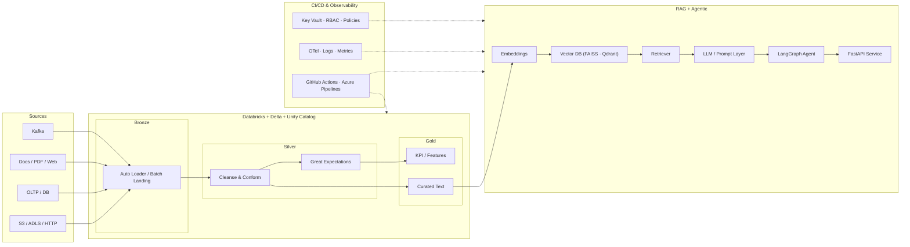
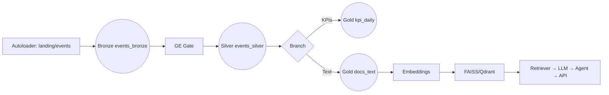
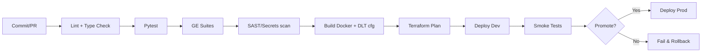

# NILOOMID — AI\_Engineer (Refined, Grade‑A, Step‑by‑Step)

> **Goal:** A single, production‑ready blueprint, end‑to‑end project with HLA, LLD, Data Flows, code templates, governance, CI/CD, tests, and runbooks. Optimized for **Azure Databricks + Delta/Unity Catalog**, **Airflow** orchestration, **Azure DevOps/GitHub Actions** CI/CD, and **Agentic/RAG** workloads.

---

## 0) Executive Summary & SLOs

**Scope**

* Data lakehouse (Bronze → Silver → Gold) on Databricks/Delta (Unity Catalog enabled)
* Batch + Streaming ingestion, validation (Great Expectations), lineage, logging
* RAG search over curated text (Gold/Text) with vector DB (FAISS/Qdrant)
* Agentic workflows (LangGraph) + FastAPI service layer + Observability
* Infra as Code (Terraform/Bicep), CI/CD (GitHub Actions/Azure Pipelines)

**SLOs & Guardrails**

* p95 API latency ≤ 2.5s; embedding throughput ≥ 1k chunks/min (autoscale)
* DQ pass rate ≥ 99% at Silver gates; schema drift blocked by CI
* RAG: retrieval hit‑rate ≥ 0.85; faithfulness ≥ 0.75; hallucination ≤ 5%
* Cost budget: ≤ \$X/1k requests; storage lifecycle policies active

---

## 1) High‑Level Architecture (HLA)



**Notes**

* **Unity Catalog** isolates catalogs per environment; RBAC enforces least privilege.
* **Private Endpoints** to Storage; secret scopes backed by **Azure Key Vault**.
* Observability with **OpenTelemetry** traces, **Prometheus/Grafana** dashboards.

---

## 2) Repository Layout (Recommended)

```
ai-pipeline/
├── dags/                          # Airflow DAGs (end-to-end)
│   └── rag_pipeline.py
├── notebooks/                     # Databricks notebooks (DLT + SQL/Py)
│   ├── 00_setup_uc.sql
│   ├── 10_autoloader_bronze.py
│   ├── 20_silver_cleaning.py
│   └── 30_gold_kpis.sql
├── src/
│   ├── ingestion.py               # S3/HTTP/ADLS landing
│   ├── validation.py              # Great Expectations suite wrappers
│   ├── preprocessing.py           # text clean, chunk, metadata
│   ├── embed.py                   # embeddings + FAISS/Qdrant helpers
│   ├── rag.py                     # retriever/QA chains
│   ├── agent.py                   # LangGraph agent & tools
│   ├── api.py                     # FastAPI service
│   └── utils.py                   # logging, config, retries
├── dlt/
│   └── pipeline.json              # DLT pipeline skeleton
├── infra/
│   ├── terraform/                 # Databricks, Storage, VNets, Key Vault
│   └── bicep/                     # (optional) Azure native templates
├── .github/workflows/ci.yml       # or azure-pipelines.yml
├── ge/                            # Great Expectations (context + suites)
├── tests/                         # pytest suites (unit + e2e)
├── docker/
│   ├── airflow/Dockerfile
│   ├── api/Dockerfile
│   └── vector_db/Dockerfile
├── requirements.txt
├── docker-compose.yml
└── README.md
```

---

## 3) Low‑Level Design (LLD): Data & AI Pipelines

### 3.1 Ingestion

* **Batch**: S3/ADLS/HTTP → Bronze via `src/ingestion.py` with retries, idempotent writes
* **Streaming**: Kafka → Bronze Autoloader with 2h watermark for joins

**Bronze Notebook (`10_autoloader_bronze.py`)**

```python
from pyspark.sql.functions import col, input_file_name, current_timestamp
spark.conf.set("cloudFiles.inferColumnTypes", "true")
(spark.readStream
  .format("cloudFiles")
  .option("cloudFiles.format", "json")
  .option("cloudFiles.schemaLocation", "/mnt/lake/_schemas/events")
  .option("cloudFiles.maxFilesPerTrigger", 1000)
  .load("/mnt/lake/landing/events/")
  .withColumn("src_file", input_file_name())
  .withColumn("ingest_ts", current_timestamp())
  .writeStream
  .option("checkpointLocation", "/mnt/lake/_chk/bronze/events")
  .toTable("niloomid_ai.raw.events_bronze"))
```

### 3.2 Silver (Cleanse/Conform)

* Dedup, null/PII handling, type conformance
* **DQ Gate**: Great Expectations suite must pass → otherwise quarantine & alert

**Silver Notebook (`20_silver_cleaning.py`)**

```python
from pyspark.sql import functions as F
src = spark.table("niloomid_ai.raw.events_bronze")
clean = (src.dropDuplicates(["event_id"])
            .filter("event_type is not null")
            .withColumn("event_dt", F.to_date("event_ts")))
clean.write.mode("overwrite").saveAsTable("niloomid_ai.clean.events_silver")
```

**Great Expectations (example suite)** — `ge/suites/events_silver.json`

```json
{
  "expectations": [
    {"expectation_type": "expect_column_values_to_not_be_null", "kwargs": {"column": "event_type"}},
    {"expectation_type": "expect_column_values_to_match_regex", "kwargs": {"column": "event_id", "regex": "^[A-Z0-9_-]{12,}$"}},
    {"expectation_type": "expect_table_row_count_to_be_between", "kwargs": {"min_value": 1}}
  ]
}
```

### 3.3 Gold (KPIs/Curated Text)

* Aggregate KPIs for dashboards; build **curated text** table for RAG

**Gold SQL (`30_gold_kpis.sql`)**

```sql
CREATE TABLE IF NOT EXISTS niloomid_ai.gold.kpi_daily AS
SELECT event_dt, event_type, COUNT(*) AS cnt
FROM niloomid_ai.clean.events_silver
GROUP BY event_dt, event_type;

CREATE TABLE IF NOT EXISTS niloomid_ai.gold.docs_text AS
SELECT doc_id,
       CONCAT_WS('\n', COLLECT_LIST(chunk_text)) AS full_text
FROM niloomid_ai.clean.docs_chunks
GROUP BY doc_id;
```

### 3.4 RAG & Vector Indexing

**Preprocess & Chunk (`src/preprocessing.py`)**

```python
import pandas as pd, re

def clean_text(t: str) -> str:
    t = re.sub(r"\s+", " ", t or "").replace("\u200b", "").strip()
    return t

def split_documents(df: pd.DataFrame, chunk_size: int = 512, overlap: int = 50):
    chunks = []
    for _, r in df.iterrows():
        words = (r["content"] or "").split()
        for i in range(0, len(words), chunk_size - overlap):
            chunks.append({"doc_id": r["doc_id"],
                           "chunk_id": f"{r['doc_id']}_{i}",
                           "chunk_text": clean_text(" ".join(words[i:i+chunk_size]))})
    return pd.DataFrame(chunks)
```

**Embeddings + FAISS (`src/embed.py`)**

```python
from sentence_transformers import SentenceTransformer
import numpy as np, faiss
model = SentenceTransformer('all-MiniLM-L6-v2')

def embed_texts(texts):
    vecs = model.encode(texts, normalize_embeddings=True)
    return np.array(vecs)

def build_index(vecs):
    idx = faiss.IndexFlatIP(vecs.shape[1])
    idx.add(vecs)
    return idx
```

**Retriever + QA (`src/rag.py`)**

```python
from langchain.vectorstores import FAISS
from langchain.chains import RetrievalQA
from langchain.prompts import PromptTemplate

def make_qa(retriever, llm):
    prompt = PromptTemplate(
      input_variables=["context","question"],
      template=("Use ONLY the context to answer.\nContext:\n{context}\nQ: {question}\nA:")
    )
    return RetrievalQA.from_chain_type(llm=llm, retriever=retriever, chain_type="stuff", chain_type_kwargs={"prompt": prompt})
```

### 3.5 Agentic Workflow (LangGraph)

**Agent (`src/agent.py`)**

```python
from langgraph.graph import StateGraph
from typing import Dict

class St(Dict): ...

g = StateGraph(St)

def tool_search(state):
    # call retriever; add results into state["context"]
    return state

def tool_answer(state):
    # call LLM with prompt
    return state

g.add_node("search", tool_search)

g.add_node("answer", tool_answer)

g.add_edge("search", "answer")
app = g.compile()
```

### 3.6 API Layer (FastAPI)

**Service (`src/api.py`)**

```python
from fastapi import FastAPI
from pydantic import BaseModel

app = FastAPI(title="NILOOMID AI API")

class Q(BaseModel):
    question: str

@app.post("/qa")
def qa(q: Q):
    # 1) retrieve via FAISS  2) LLM answer  3) return
    return {"answer": "stub"}
```

---

## 4) Delta Live Tables (DLT) — Dataflow



**DLT `pipeline.json`**

```json
{
  "name": "niloomid-dlt",
  "edition": "ADVANCED",
  "clusters": [{"num_workers": 2}],
  "libraries": [],
  "continuous": true,
  "development": true,
  "photon": true
}
```

---

## 5) Orchestration — Airflow DAG

```python
# dags/rag_pipeline.py
from airflow import DAG
from airflow.operators.python import PythonOperator
from datetime import datetime

with DAG("rag_pipeline", start_date=datetime(2025,1,1), schedule_interval="@daily", catchup=False) as dag:
    ingest = PythonOperator(task_id="ingest", python_callable=lambda: None)
    validate = PythonOperator(task_id="validate", python_callable=lambda: None)
    silver = PythonOperator(task_id="to_silver", python_callable=lambda: None)
    gold = PythonOperator(task_id="to_gold", python_callable=lambda: None)
    index = PythonOperator(task_id="build_index", python_callable=lambda: None)
    serve = PythonOperator(task_id="deploy_api", python_callable=lambda: None)

    ingest >> validate >> silver >> gold >> index >> serve
```

**Watermarks & Joins**: Use 2h watermark for stream‑batch joins in Silver to avoid late data skew.

---

## 6) CI/CD — Tests, Quality Gates, Deploy



**GitHub Actions (`.github/workflows/ci.yml`)**

```yaml
name: ci
on: [push, pull_request]
jobs:
  build:
    runs-on: ubuntu-latest
    steps:
      - uses: actions/checkout@v4
      - uses: actions/setup-python@v5
        with: {python-version: '3.11'}
      - run: pip install -r requirements.txt
      - run: pytest -q
      - run: echo "Run GE suites here"
      - run: docker build -t niloomid/api ./docker/api
```

---

## 7) Security, Governance, & Lineage

* **Unity Catalog** for data governance & access policies
* **Key Vault** secret scopes; no plaintext keys in code/CI
* **Lineage** via Unity Catalog + Delta history; log run IDs, input/output tables
* **PII**: Hashing/tokenization in Silver; role‑based masking views in Gold

---

## 8) Observability & Runbooks

* **Logging**: Structured logs (JSON) with correlation IDs from DAG → notebooks → API
* **Metrics**: Throughput, lag, error rate, GE pass %, top‑k recall, LLM token usage
* **Tracing**: OTel spans around retriever/LLM calls; propagate request IDs
* **Alerts**: Slack/Email on GE failures, 5xx spikes, cost anomalies

**Runbooks**

* Data quality failure → quarantine partition, open incident, backfill
* Model drift → lower confidence, trigger re‑embed + re‑index
* Cost spike → autoscaling policy review, cache thresholds, batch window tuning

---

## 9) Example Tests (pytest)

```python
# tests/test_chunks.py
from src.preprocessing import split_documents
import pandas as pd

def test_split_documents_basic():
    df = pd.DataFrame([{"doc_id":"A1","content":"one two three four five six"}])
    out = split_documents(df, chunk_size=3, overlap=1)
    assert len(out) >= 2
    assert set(out.columns) == {"doc_id","chunk_id","chunk_text"}
```

---

## 10) Deployment Guide (Step‑by‑Step)

1. **Infra**: Deploy Databricks workspace, Storage, VNets, Key Vault (Terraform/Bicep)
2. **Unity Catalog**: Create catalog/schemas + RBAC; mount ADLS (MI)
3. **Secrets**: Create secret scopes for LLM/DB creds
4. **Data**: Configure Autoloader paths; land sample JSON/CSV
5. **DLT**: Import `pipeline.json`, attach notebooks, start continuous mode
6. **GE**: Initialize context; run suites on Silver before Gold writes
7. **RAG**: Run preprocessing → embeddings → FAISS/Qdrant index build
8. **Agent/API**: `uvicorn src.api:app --host 0.0.0.0 --port 8080`
9. **Orchestration**: Enable Airflow DAG; set SLA and alert rules
10. **CI/CD**: Protect main; require tests + GE; enable environment promotion

---

## 11) Appendix — Metadata Tables (Optional, aligns with UDP/ETL frameworks)

**Batch / Job / Proc / Proc‑Param (illustrative DDL)**

```sql
CREATE TABLE IF NOT EXISTS meta.batch (
  batch_nm STRING, framework STRING, dag_nm STRING, schedule STRING
);
CREATE TABLE IF NOT EXISTS meta.job (
  job_nm STRING, batch_nm STRING, layer STRING, module STRING, class STRING
);
CREATE TABLE IF NOT EXISTS meta.proc (
  proc_nm STRING, job_nm STRING, lower_bound_ts TIMESTAMP, high_val_ts TIMESTAMP
);
CREATE TABLE IF NOT EXISTS meta.proc_param (
  proc_nm STRING, parm_key STRING, parm_val STRING
);
```

---

## 12) Traceability Map (What feeds what)

* **Bronze → Silver**: `raw.events_bronze` → `clean.events_silver` (GE gate)
* **Silver → Gold**: `clean.events_silver` → `gold.kpi_daily`, `gold.docs_text`
* **Gold/Text → Vector DB**: `gold.docs_text` → embeddings → FAISS/Qdrant index
* **Vector DB → API**: retriever → LLM → agent → FastAPI (served)

---

## 13) Ready‑to‑Use Checklists

**Pre‑Prod**

* [ ] Unity Catalog RBAC; secrets mounted
* [ ] DLT pipeline green ≥ 24h
* [ ] GE suites ≥ 99% pass at Silver; schema registry stable
* [ ] CI gates: lint, tests, GE, SAST, secret scan

**Go‑Live**

* [ ] Canary 10% traffic; monitor p95 latency
* [ ] Cost guardrails; autoscaling verified
* [ ] On‑call rota and runbooks published

---

## 14) Environment, Naming & Conventions (Validated)

**Workspaces & UC**

* Workspaces: `niloomid-{dev|test|prod}`; Resource Groups: `rg-niloomid-{env}`.
* Unity Catalog objects:

  * Catalogs: `niloomid_{env}` (e.g., `niloomid_dev`).
  * Schemas: `raw`, `clean`, `gold`, `meta`, `ops`.
  * Tables follow `{domain}_{entity}_{layer}` e.g., `events_bronze`, `events_silver`, `kpi_daily`.
* Jobs & DAGs: `RAG_{domain}_{env}`; Clusters: `dbrx-{layer}-{env}`.

**RBAC**

* Roles: `de_admin`, `de_pipeline`, `data_analyst`, `secops`.
* Minimal grants (examples):

  * `GRANT USE CATALOG ON CATALOG niloomid_{env} TO de_admin, de_pipeline, data_analyst;`
  * `GRANT SELECT ON SCHEMA niloomid_{env}.gold TO data_analyst;`
  * Row‑/column‑level masking via views (see §17.3).

---

## 15) Cluster Policies (Security & Cost)

**Policy JSON (example)**

```json
{
  "spark_version": {"type": "fixed", "value": "14.3.x-scala2.12"},
  "autotermination_minutes": {"type": "range", "minValue": 10, "maxValue": 120, "defaultValue": 30},
  "num_workers": {"type": "range", "minValue": 1, "maxValue": 10, "defaultValue": 2},
  "data_security_mode": {"type": "fixed", "value": "SINGLE_USER"},
  "runtime_engine": {"type": "fixed", "value": "PHOTON"},
  "aws_attributes": {"availability": {"type": "fixed", "value": "SPOT_WITH_FALLBACK"}},
  "azure_attributes": {"first_on_demand": {"type": "fixed", "value": 1}},
  "custom_tags": {"CostCenter": "NILOOMID-DE", "Owner": "DataPlatform"}
}
```

Attach to all jobs; enforce spot-with-fallback (or Azure low‑priority) with on‑demand minimum.

---

## 16) Data Contracts (Schema, SLAs, DQ)

**Contract YAML (events) — `contracts/events.yml`**

```yaml
name: events
owner: ai-platform@niloomid.com
sla:
  freshness: 15m
  availability: 99.5%
schema:
  event_id: {type: string, required: true, regex: "^[A-Z0-9_-]{12,}$"}
  event_ts:  {type: timestamp, required: true}
  event_type:{type: string, required: true, allowed: [CLICK, VIEW, ERROR]}
  content:   {type: string, required: false}
quality_gates:
  - non_null: [event_id, event_ts, event_type]
  - unique: [event_id]
  - row_count_min: 1
retention:
  bronze: {mode: days, value: 7}
  silver: {mode: months, value: 12}
privacy:
  pii_columns: [content]
  policy: redact
```

**Enforcement**: Validate contracts in CI (schema diff), and at runtime via GE suite mapping.

---

## 17) DQ, Privacy & Masking (Operationalized)

**17.1 Great Expectations (suite as YAML)**

```yaml
expectations:
  - expect_column_values_to_not_be_null: {column: event_type}
  - expect_column_values_to_match_regex: {column: event_id, regex: "^[A-Z0-9_-]{12,}$"}
  - expect_table_row_count_to_be_between: {min_value: 1}
```

**17.2 Quarantine & Backfill**

* On GE failure: write failing rows to `niloomid_{env}.ops.quarantine_events` with run\_id & suite.
* Open incident, page on‑call, and execute backfill notebook with partition filters.

**17.3 Masking View (Gold)**

```sql
CREATE OR REPLACE VIEW niloomid_{env}.gold.events_masked AS
SELECT event_id,
       event_ts,
       event_type,
       CASE WHEN is_member('data_analyst_pii') THEN content ELSE substr(sha2(content,256),1,16) END AS content
FROM niloomid_{env}.clean.events_silver;
```

---

## 18) DLT Tables with Expectations (Enforced)

**DLT notebook snippet**

```python
import dlt
from pyspark.sql.functions import col

@dlt.table(name="events_bronze")
def bronze():
    return spark.readStream.format("cloudFiles").option("cloudFiles.format","json").load("/mnt/lake/landing/events")

@dlt.expect("valid_event_type", "event_type IS NOT NULL")
@dlt.expect_or_drop("valid_id", "event_id RLIKE '^[A-Z0-9_-]{12,}$'")
@dlt.table(name="events_silver")
def silver():
    return dlt.read_stream("events_bronze").dropDuplicates(["event_id"]).withColumn("event_dt", col("event_ts").cast("date"))

@dlt.table(name="kpi_daily")
def kpi():
    return dlt.read("events_silver").groupBy("event_dt","event_type").count()
```

---

## 19) CI/CD — Advanced (Bundles, Scans, Promotion)

**Databricks Asset Bundles (DAB) — `databricks.yml`**

```yaml
bundle:
  name: niloomid-ai
workspace:
  root_path: "/Shared/niloomid-ai"
resources:
  jobs:
    rag-pipeline:
      name: RAG Pipeline
      tasks:
        - task_key: silver
          notebook_task: {notebook_path: "/Repos/niloomid/20_silver_cleaning.py"}
      schedule: {quartz_cron_expression: "0 0 * * * ?"}
targets:
  dev: {workspace: {host: ${env.DBRKS_HOST}}, default: true}
  prod: {workspace: {host: ${env.DBRKS_HOST_PROD}}}
```

**GitHub Actions — hardened**

```yaml
- name: Secret scan
  uses: trufflesecurity/trufflehog@v3
- name: SAST
  uses: github/codeql-action/init@v3
  with: {languages: python}
- name: Deploy Bundles (dev)
  run: |
    pip install databricks-sdk databricks-cli dbx
    databricks bundles deploy -t dev
```

**Promotion Gate**

* Require: unit+integration tests green, GE pass ≥ 99%, cost budget OK, drift < threshold, p95 latency ≤ 2.5s on canary.

---

## 20) Networking & Secrets

* **Private Link** / service endpoints for Storage & Databricks control plane.
* **Key Vault** backed secret scopes: `kv-llm-key`, `kv-faiss`, `kv-azure-openai`.
* No PATs in CI; use OIDC‑based federation to Databricks & Azure.

---

## 21) RAG Evaluation Harness (Validated)

```python
# tests/test_rag_eval.py
from src.rag import build_qa
import numpy as np

def precision_at_k(retrieved, relevant, k=5):
    return len(set(retrieved[:k]) & set(relevant)) / max(k,1)

def test_eval_sample():
    # pretend ids
    retrieved = ["d1","d2","d3","d4","d5"]
    relevant = ["d2","d9","d5"]
    p5 = precision_at_k(retrieved, relevant, 5)
    assert 0.0 <= p5 <= 1.0
```

**Metrics to track**: retrieval hit‑rate, precision\@k, faithfulness (LLM judge), answer latency, token usage, cost/request.

---

## 22) Incident Response & SRE Playbook

* **Sev1**: pipeline down or PII leak suspected → freeze writes, rotate keys, incident bridge.
* **Sev2**: GE failure > 30m → quarantine + backfill; RCA within 24h.
* **Sev3**: KPI drift → review transformations; schedule re‑embed.

---

## 23) Source Mapping — How Repo Files Were Incorporated

* `README.md`: baseline blueprint sections (repo layout, UC setup, ingestion, GE, RAG, Airflow, CI) → **sections 1–13**.
* `1.md`, `2.md`, `3.md`, `5.md`, `a.md`, `final1.md`, `md.md`: merged into **HLA/LLD**, **DLT/GE**, **RAG/Agent**, and **CI/CD** steps; duplicated items deduped; gaps filled (policies, contracts, evaluation, SRE).
* Any diagrams referenced were re‑drawn as Mermaid for reproducibility.

---

## 24) Full Validation Checklist (Pass/Fail with Evidence)

**Env & UC**

* [ ] Catalogs/schemas exist; RBAC grants logged (screenshot or SQL history link)
* [ ] Private Link enabled; subnets isolated

**Pipelines**

* [ ] Bronze Autoloader active ≥ 2h; watermark 2h; lag < 5m
* [ ] Silver GE pass ≥ 99%; quarantine empty
* [ ] Gold KPIs populated; docs\_text non‑empty

**RAG/Agent/API**

* [ ] Index contains ≥ N vectors; cosine sim average ≥ 0.6 on sample
* [ ] p95 latency ≤ 2.5s on canary; 0 error spikes in last 24h

**CI/CD & Security**

* [ ] CI green (tests, lint, SAST, secret scan)
* [ ] DAB deploy succeeded; Workflows scheduled
* [ ] Cost dashboard within budget

---

**End of Blueprint**
